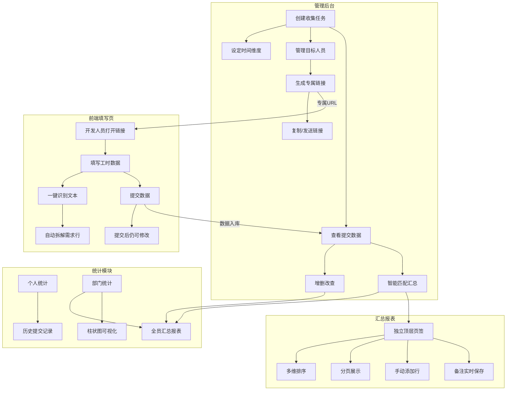
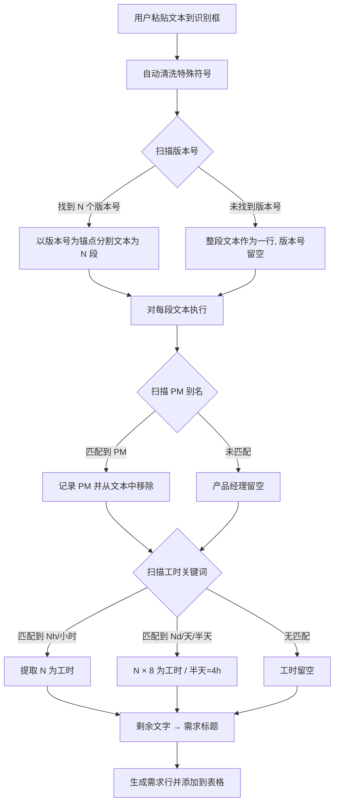

# DevTracker — 开发人员工时统计系统 · 需求基准文档

> **版本**：v0.5.0 | **日期**：2026-04-15  
> **文档编号**：D01 | **性质**：唯一需求基准文档（融合 v0.2.0 + v0.4.0 CHG-001~029 + 后续对话微调）

---

## 一、项目概述

### 1.1 项目背景

团队需要一套轻量化的工时统计工具，用于收集各开发人员（前端/后端/测试）在指定时间段内的工作内容，并自动汇总生成结构化的需求维度报表。

### 1.2 核心目标

- **便捷采集**：管理员生成链接 → 分发给开发人员 → 各自填写提交
- **智能汇总**：对不同角色提交的相同需求进行模糊匹配，自动归并
- **多维统计**：支持个人历史记录查看和部门整体统计

### 1.3 用户角色

| 角色 | 权限 |
|:---|:---|
| **管理员** | 后台管理、创建任务、管理人员名单、查看统计报表、增删改查数据 |
| **开发人员** | 通过专属链接填写工时、查看个人历史统计 |

---

## 二、系统架构



### 2.1 全局导航结构

```
任务清单 | 汇总报表 | 周期统计        [新建收集] [管理员] [团]
```

**导航规则**：
- 主导航三项：**任务清单** (`#/tasks`) → **汇总报表** (`#/report`) → **周期统计** (`#/stats`)
- **团队人员** (`#/personnel`) 通过 Header 右侧「团」圆形徽章进入（不占用主导航位）
- 二级页面（任务详情 `#/task/:id`、团队人员 `#/personnel`）显示 **返回按钮**
- 页面标题：`研发效能度量 - DevTracker`

---

## 三、功能模块详细设计

### 3.1 任务清单 (`#/tasks`)

#### 3.1.1 创建收集任务

- 管理员点击「新建收集」按钮
- 弹窗采用**左右双栏布局**：
  - 左侧：时间维度选择 + 参考日期 + 任务预览 + 快捷周期列表
  - 右侧：日历面板（高亮选中范围）
- 选择时间维度：日 / 周（默认上周）/ 半月 / 月 / 季度 / 半年 / 年
- 日历与表单**双向实时联动**：
  - 表单选维度/日期 → 日历高亮对应日期范围
  - 日历点击日期 → 表单自动更新为该日所在周
  - 快捷列表点击 → 表单和日历同步更新
- 若日历选中范围超出当前维度范畴，维度显示为"其他"
- 系统自动生成任务标题，如：`2026年04月06日-2026年04月12日，本年度第15周工作统计`

#### 3.1.2 任务列表展示

按 **年度 → 季度** 两级层级结构展示，季度标签显示 Q 徽章（如 Q2）。

**列结构**：

| 列 | 宽度 | 说明 |
|:---|:---|:---|
| 时间范围 | 100px | 上下双行以 `\|` 间隔显示起止日期 |
| 任务标题 | 自适应 | 任务名称，加粗 |
| 维度 | 100px | 灰色 Tag 标签 |
| 记录数 | 80px | 该任务下的提交记录总数 |
| 状态 | 100px | 收集中（绿色）/ 已归档（灰色）/ 草稿 |
| 操作 | 80px | 蓝色「查看」按钮，点击跳转到任务详情 |

**特殊规则**：
- **最近一笔任务着重显示**：按 `createdAt` 排序最新一条，左侧显示 3px 主色竖条，背景微染 `#E8F3FF`
- 行高紧凑化：行内边距 `padding: 8px 24px`
- 点击整行或「查看」按钮均可进入任务详情

---

### 3.2 单任务详情页 (`#/task/:id`)

进入单条任务后，页面顶部显示面包屑导航（任务清单 › 当前任务标题），下方为**三 Tab 切换**：

#### 3.2.1 提交数据 Tab

**列结构**：

| 列序 | 列名 | 说明 |
|:---:|:---|:---|
| 1 | 序号 | 自增 |
| 2 | 人员 | 姓名加粗 |
| 3 | 角色 | 彩色 Tag（前端蓝/后端绿/测试橙） |
| 4 | 版本号 | 等宽字体 |
| 5 | 需求标题 | 主信息 |
| 6 | 产品经理 | 逗号分隔 |
| 7 | 工时(h) | 主色加粗 |
| 8 | 提交时间 | `createdAt` |
| 9 | 最新修改时间 | `updatedAt` |
| 10 | 操作 | 编辑 / 删除 |

**排序规则**：按 `staffId` 分组（同名挨在一起），组内按 `createdAt` 正序。

**内联编辑**：点击「编辑」按钮后，该行可编辑字段变为 `<input>` 控件，按钮变为「保存」。保存后更新 Store 并重新渲染。

**删除**：点击「删除」按钮后，确认后从 Store 中移除记录并刷新列表。

#### 3.2.2 链接管理 Tab

**预设通知文本框**：表格上方新增 `<textarea>` 多行文本域。
- 默认值："请填写本周工作内容，链接如下："
- 点击「复制」或「发送」时，内容 = 预设文本 + 换行 + 对应的专属链接。

**列结构**：

| 列 | 说明 |
|:---|:---|
| 人员 | 加粗 |
| 角色 | 彩色 Tag |
| 专属链接 | 渲染为可点击的 `<a>` 标签，直接跳转到填写页 |
| 提交状态 | 已提交（绿）/ 未提交（灰） |
| 操作 | 「复制」和「发送」按钮 |

**发送行为**（Demo 阶段）：点击「发送」执行 `showToast('已通过钉钉发送给 xxx')`。正式版通过 `dingtalk://` 协议打开钉钉聊天窗口。

#### 3.2.3 汇总报表 Tab（快捷入口）

作为该任务下的汇总报表快捷入口，数据内容与独立的「汇总报表」页签一致，但固定显示当前任务的数据（无需任务选择器）。

---

### 3.3 前端填写页 (`#/fill/:token`)

#### 3.3.1 页面布局

- 独立布局（隐藏管理端导航和侧边栏）
- 宽度：两侧各留 `100px` 留白，其余铺满
- 纸张式白色画布居中

#### 3.3.2 页面标题

动态格式：`xxxx年xx月xx日，本年度第xx周工作统计`  
副标题：`【前端/后端/测试】张三 工作内容填写`

#### 3.3.3 一键识别文本框 ⚡

在填写表格上方新增「一键识别」文本域，用户粘贴自然语言文本后系统自动拆解并回填到表格：

**识别规则引擎（按优先级）**：

| 优先级 | 目标字段 | 识别规则 |
|:---:|:---|:---|
| 1 | 版本号 | 以 `V/v` 开头 + 数字 + `.` + 数字 + `.` + 数字 的连续串。最高优先。 |
| 2 | 版本号（备选） | 无 V 前缀但包含两个小数点的连续数字串（如 `4.633.0`），自动补 `V` 前缀。 |
| 3 | 工时（小时） | `0.5-24` 范围的数字后紧跟 `小时/h/H/时`。如 `5h` → 5.00h。支持小数如 `1.5h`。 |
| 4 | 工时（天转换） | `0.5-7` 范围的数字后紧跟 `D/d/天/日`（含小数如 `1.5天`、含斜杠如 `2.5/天`）。提取数字 × 8 = 工时。`半天` = 4h。 |
| 5 | 产品经理 | 扫描文本中是否包含 PM 名称的全称或别名，匹配后自动回填产品经理字段。 |
| 6 | 需求标题 | 去除版本号、工时关键词和 PM 名称后的剩余纯文字描述，自动去除首尾标点和空白。 |

**产品经理智能匹配规则**：

系统在每个文本段中扫描以下别名。全名优先匹配（避免单字误匹配），匹配后自动从标题中移除已识别的人名文字。

| PM 全名 | 可匹配的别名（含全名） |
|:---|:---|
| 钟冠 | 钟冠、钟、冠 |
| 吴浩鑫 | 吴浩鑫、浩鑫、吴、鑫 |
| 杨瑞 | 杨瑞、杨、瑞 |
| 罗晓璇 | 罗晓璇、晓璇、罗、璇 |
| 其他-昆仑 | 昆仑 |
| 其他-短信 | 短信 |
| 其他-架构 | 架构 |

**特殊符号自动清洗**：
- **保留**：中文标点 `，。；！【】`、括号 `(){}[]（）`、常用符号 `@#%&=`
- **移除**：所有其他特殊符号（如 `★※☆◆●▶◇△` 等装饰符号）

**多版本号处理**：若输入包含多个版本号，以版本号为锚点分割文本为多段，每段生成一个独立的需求行。

**无单位兜底数字**：行尾独立数字默认为**小时**（非天），范围 0.5~200。

**多行文本处理**：支持换行符分割，每行独立识别。



#### 3.3.4 填写表格

| 字段 | 类型 | 说明 |
|:---|:---|:---|
| 序号 | 自动 | 自增序号 |
| 需求标题 | 文本输入 | 手动输入需求名称 |
| 版本号 | 文本输入 | 如 V2.333.0 |
| 需求产品人员 | 自定义下拉多选 | 选中后以 Tag 标签展示，支持单选/多选 |
| 工时（小时） | 数字输入 | 精确到**小数点后两位**，步长 0.01，范围 0.01-200 |

**交互功能**：
- 「+ 新增需求行」按钮
- 每行有删除按钮
- 「暂存草稿」和「提交」按钮
- 提交后仍可修改

---

### 3.4 汇总报表页 (`#/report`) ⚡

> **独立为顶层主导航页签（第二项）**

#### 3.4.1 页面结构

```
┌─────────────────────────────────────────────────────┐
│ [任务周期选择器]                  总工时: XXX h      │
├─────────────────────────────────────────────────────┤
│ [新增行] [排序: PM(默认) | 前端 | 后端 | 测试]       │
├──┬──────┬─────────┬──────┬────┬────┬────┬──────┬────┤
│序│版本号│需求名称  │产品PM│前端│后端│测试│总计/h│备注│
│  │      │(加宽)   │      │人/h│人/h│人/h│      │可编│
├──┼──────┼─────────┼──────┼────┼────┼────┼──────┼────┤
│..|......|.........|......|....|....|....|......|....│
├──┴──────┴─────────┴──────┼────┼────┼────┼──────┤    │
│                   列合计 │ XX │ XX │ XX │ XXX  │    │
├──────────────────────────┴────┴────┴────┴──────┴────┤
│ [分页: < 1 2 3 ... >]              每页 20 条       │
└─────────────────────────────────────────────────────┘
```

#### 3.4.2 列结构

| 列序 | 列名 | 宽度 | 说明 |
|:---:|:---|:---|:---|
| 1 | 序号 | 40px | 自增 |
| 2 | 版本号 | 100px | 等宽字体 |
| 3 | 需求名称 | **加宽**/自适应 | 主信息 |
| 4 | 产品经理 | 120px | |
| 5 | 前端（人员/工时） | **缩窄** | 人员名 + 工时 |
| 6 | 后端（人员/工时） | **缩窄** | 人员名 + 工时 |
| 7 | 测试（人员/工时） | **缩窄** | 人员名 + 工时 |
| 8 | 工时总计/h | 100px | 前端+后端+测试之和 |
| 9 | 备注 | 150px | 可编辑输入，blur 事件自动保存 |

#### 3.4.3 排序规则

- **默认排序**：按产品经理名称分组（同名 PM 排列在一起），组内按版本号排列
- **可切换排序**：点击「前端」/「后端」/「测试」按钮，按该角色人员姓名的**拼音首字母**排序（同名人员排列相邻），使用 `localeCompare('zh-Hans')`
- 当前激活的排序按钮以主色高亮

#### 3.4.4 工时总计体系

- 每行末尾的「工时总计/h」列 = 该行前端+后端+测试工时之和
- 表格底部**每个工时列**显示该列所有行的合计
- **表格右上角**显示当前列表全部记录的工时总数

#### 3.4.5 可编辑备注

- 每行渲染为 `<input type="text">`
- `blur` 事件触发自动保存到 localStorage

#### 3.4.6 手动添加行

页面上方「新增行」按钮，点击后在列表顶部添加空白行，可手动填写，实时统计到各总计。

#### 3.4.7 分页

- 单页默认显示 **20 条**
- 底部显示分页控件（上一页 / 页码 / 下一页）
- 切换页码时平滑刷新数据区域

#### 3.4.8 字体规范

表格内文字 `14px`，表头 `13px`（相比其他表格加大）。

---

### 3.5 周期统计 (`#/stats`)

#### 3.5.1 部门全观

**筛选器**：
- 年度选择器：默认当前年（2026）
- 季度选择器：Q1/Q2/Q3/Q4，默认当前季度
- 任务周期选择器：季度下的全部收集任务，默认"全部周期"
- 三级联动：切换筛选后触发数据重新过滤与渲染

**统计概要卡片**：

| 卡片 | 数据来源 |
|:---|:---|
| 当前季度总工时/小时 | 筛选后的前端+后端+测试全部工时合计 |
| 提交记录数 | 筛选范围内已提交的需求记录总数 |
| 研发人员 | 含前端/后端/测试的人员数量 |
| 收集任务数 | 筛选范围内的收集任务数量 |

**部门汇总明细表**：

| 列 | 说明 |
|:---|:---|
| 序号 | 自增 |
| 版本号 | 等宽字体 |
| 需求名称 | 主信息 |
| 产品经理 | |
| 前端累计工时 | 该需求下所有前端人员工时之和（纯数值） |
| 后端累计工时 | 该需求下所有后端人员工时之和（纯数值） |
| 测试累计工时 | 该需求下所有测试人员工时之和（纯数值） |

**柱状图** ⚡：

- 类型：分组柱状图（Grouped Bar Chart）
- X 轴：每个产品经理名称
- Y 轴：工时数
- 技术方案：Canvas 2D API 原生绘制（零依赖）
- 每个 PM 显示 4 组柱形：

| 柱形 | 颜色 | 说明 |
|:---|:---|:---|
| 前端总计 | `#165DFF`（蓝） | 该 PM 下所有需求的前端工时之和 |
| 后端总计 | `#00B42A`（绿） | 该 PM 下所有需求的后端工时之和 |
| 测试总计 | `#FF7D00`（橙） | 该 PM 下所有需求的测试工时之和 |
| 总计 | `#F53F3F`（红） | 前端+后端+测试总和 |

- 柱顶标注：每个柱形顶部显示**加粗的实际数值**
- Canvas 宽度自适应容器，高度固定 360px

#### 3.5.2 个人聚焦

**人员选择方式**：所有角色的人员在**同一行内水平平铺**，每人前有角色色标（蓝/绿/橙圆点），无需按角色分行。

**个人概要卡片**：头像 + 姓名 + 角色 Tag + 总工时/记录数/参与周期数。

**参与任务列表**：可折叠手风琴面板（Accordion），默认收起，点击展开查看该任务周期下的详细记录。

---

### 3.6 团队人员管理 (`#/personnel`)

- 通过 Header 右侧「团」圆形徽章进入
- 二级页面，显示返回按钮
- 维护开发人员名单（姓名 + 角色：前端/后端/测试）
- 支持增删改：
  - **新增**：弹窗输入姓名和选择角色
  - **编辑**：弹窗修改姓名/角色
  - **删除**：确认后从 Store 移除
- 每次「生成链接」时，为名单内每个人生成独立的填写链接

---

### 3.7 智能匹配与汇总

**匹配规则**：

1. **版本号完全匹配**（权重 0.3）：版本号相同的需求优先归为同一组
2. **需求标题模糊匹配**（权重 0.5）：Jaccard + 编辑距离取最大值
3. **产品经理匹配**（权重 0.2）：同一产品经理 → 加分
4. **人工确认**：置信度低于 0.7 时标记为待确认

**匹配阈值**：

| 置信度范围 | 处理方式 |
|:---:|:---|
| ≥ 0.7 | 自动归并 `auto_merged` |
| 0.5 ~ 0.7 | 待确认 `pending_review` |
| < 0.5 | 保持独立 |

---

## 四、数据模型

### 4.1 收集任务（CollectionTask）

```json
{
  "id": "string (UUID)",
  "title": "string (自动生成)",
  "timeDimension": "enum: day | week | half_month | month | quarter | half_year | year",
  "startDate": "date (YYYY-MM-DD)",
  "endDate": "date (YYYY-MM-DD)",
  "weekNumber": "number",
  "year": "number",
  "status": "enum: draft | active | closed",
  "createdAt": "datetime",
  "updatedAt": "datetime"
}
```

### 4.2 人员（Staff）

```json
{
  "id": "string (UUID)",
  "name": "string",
  "role": "enum: frontend | backend | test",
  "isActive": "boolean",
  "createdAt": "datetime"
}
```

### 4.3 填写链接（FillLink）

```json
{
  "id": "string (UUID)",
  "taskId": "string (FK → CollectionTask.id)",
  "staffId": "string (FK → Staff.id)",
  "token": "string (唯一令牌)",
  "url": "string",
  "isSubmitted": "boolean",
  "createdAt": "datetime"
}
```

### 4.4 工时记录（WorkRecord）

```json
{
  "id": "string (UUID)",
  "linkId": "string (FK → FillLink.id)",
  "taskId": "string (FK → CollectionTask.id)",
  "staffId": "string (FK → Staff.id)",
  "requirementTitle": "string",
  "version": "string (如 V2.333.0)",
  "productManagers": "string[]",
  "hours": "number (精确到小数点后两位)",
  "createdAt": "datetime",
  "updatedAt": "datetime"
}
```

### 4.5 匹配组（MatchGroup）

```json
{
  "id": "string (UUID)",
  "taskId": "string (FK → CollectionTask.id)",
  "mergedTitle": "string",
  "version": "string",
  "productManagers": "string[]",
  "frontend": [{ "staffName": "string", "hours": "number" }],
  "backend": [{ "staffName": "string", "hours": "number" }],
  "test": [{ "staffName": "string", "hours": "number" }],
  "remark": "string",
  "confidence": "number (0~1)",
  "status": "enum: auto_merged | pending_review | manual_merged"
}
```

---

## 五、API 接口规范（RESTful，正式版预留）

| 方法 | 路径 | 说明 |
|:---|:---|:---|
| `GET` | `/api/tasks` | 获取所有收集任务 |
| `POST` | `/api/tasks` | 创建收集任务 |
| `GET` | `/api/tasks/:id` | 获取单个任务详情 |
| `PUT` | `/api/tasks/:id` | 更新任务 |
| `DELETE` | `/api/tasks/:id` | 删除任务 |
| `GET` | `/api/staff` | 获取人员列表 |
| `POST` | `/api/staff` | 新增人员 |
| `PUT` | `/api/staff/:id` | 更新人员信息 |
| `DELETE` | `/api/staff/:id` | 删除人员 |
| `POST` | `/api/tasks/:taskId/generate-links` | 生成所有人员链接 |
| `GET` | `/api/fill/:token` | 通过令牌获取填写页面数据 |
| `POST` | `/api/fill/:token/records` | 提交/更新工时记录 |
| `GET` | `/api/stats/personal/:staffId` | 个人历史统计 |
| `GET` | `/api/stats/department?taskId=xxx` | 部门统计 |
| `POST` | `/api/tasks/:taskId/match` | 执行智能匹配 |
| `GET` | `/api/report?taskId=xxx` | 汇总报表数据 |

---

## 六、前端组件树

```
App
├── AdminPanel（管理后台）
│   ├── TaskList（任务清单 — 季度分组 + 最新任务高亮）
│   │   ├── TaskCard（任务行，含查看按钮）
│   │   └── CreateTaskModal（创建任务弹窗 — 左右双栏+日历）
│   ├── TaskDetail（单任务详情 — 三Tab切换）
│   │   ├── RecordsTab（提交数据 — 内联编辑 + 删除）
│   │   ├── LinksTab（链接管理 — 预设文本+发送）
│   │   └── SummaryTab（汇总报表快捷入口）
│   ├── ReportPage（汇总报表 — 独立顶层页签）
│   │   ├── TaskSelector（任务选择器）
│   │   ├── SortControls（排序切换）
│   │   ├── ReportTable（数据表格 + 底部合计 + 备注）
│   │   ├── Pagination（分页控件）
│   │   └── AddRowButton（新增行）
│   ├── StatsPage（周期统计 — 部门/个人双Tab）
│   │   ├── DeptStats（部门全观 — 联动筛选器+卡片+明细表+柱状图）
│   │   │   ├── FilterBar（年度/季度/周期三级联动筛选器）
│   │   │   ├── StatCards（概要卡片）
│   │   │   ├── DeptTable（累计工时明细表）
│   │   │   └── BarChart（Canvas 柱状图）
│   │   └── PersonalStats（个人聚焦 — 单行平铺+折叠面板）
│   └── PersonnelPage（团队人员 — 通过徽章进入）
│
└── FillPage（填写页面 — 独立布局）
    ├── FillHeader（标题区）
    ├── TextRecognizer（一键识别文本框）
    ├── FillTable（填写表格 — 自定义多选下拉）
    └── SubmitBar（提交/草稿区）
```

---

## 七、状态管理（Demo 阶段）

**localStorage Key 命名规范**：

| Key | 类型 | 说明 |
|:---|:---|:---|
| `dt_tasks` | `CollectionTask[]` | 收集任务列表 |
| `dt_staff` | `Staff[]` | 人员名单 |
| `dt_links` | `FillLink[]` | 填写链接 |
| `dt_records` | `WorkRecord[]` | 工时记录 |
| `dt_match_groups` | `MatchGroup[]` | 匹配组 |
| `dt_remarks` | `{ [groupId]: string }` | 汇总报表备注 |
| `dt_demo_version` | `string` | Demo 数据版本号 |

---

## 八、UI/UX 规范

### 8.1 色彩系统（东方高定 · 字节 Semi 标准）

| 用途 | 色值 | 说明 |
|:---|:---|:---|
| 主色 | `#165DFF` | 菁英蓝 |
| 主色悬浮 | `#4080FF` | 悬浮态 |
| 主色浅底 | `#E8F3FF` | 选中背景 |
| 成功色 | `#00B42A` | 绿 |
| 警告色 | `#FF7D00` | 橙 |
| 危险色 | `#F53F3F` | 红 |
| 文本强调 | `#1D2129` | 标题 |
| 文本常规 | `#4E5969` | 正文 |
| 文本次要 | `#86909C` | 占位符 |
| 边框 | `#E5E6EB` | 分割线 |
| 背景 | `#F2F3F5` | 页面底色 |

### 8.2 字体

- 主字体：`-apple-system, BlinkMacSystemFont, "PingFang SC", "Microsoft YaHei", "Helvetica Neue", Arial, sans-serif`
- 等宽字体：`"JetBrains Mono", Consolas, "PingFang SC", monospace`

### 8.3 动画规范

- 基础过渡：`all 0.25s cubic-bezier(0.34, 0.69, 0.1, 1)`
- 弹窗过渡：`all 0.3s cubic-bezier(0.34, 0.69, 0.1, 1)`

---

## 九、时间维度说明

| 维度 | 计算方式 |
|:---|:---|
| 日 | 指定某一天 |
| 周（默认） | 默认上周一至上周日 |
| 半月 | 1-15日 或 16日-月末 |
| 月 | 自然月 |
| 季度 | Q1(1-3月) Q2(4-6月) Q3(7-9月) Q4(10-12月) |
| 半年 | H1(1-6月) H2(7-12月) |
| 年 | 自然年 |

---

## 十、产品经理选项列表

1. 钟冠  2. 吴浩鑫  3. 杨瑞  4. 罗晓璇  
5. 其他-昆仑  6. 其他-短信  7. 其他-架构  8. 不在上述

---

## 十一、数据校验规则

| 字段 | 校验规则 |
|:---|:---|
| 需求标题 | 必填，长度 2-200 字符 |
| 版本号 | 必填，格式 `V\d+\.\d+\.\d+` |
| 产品经理 | 必填，至少选择一项 |
| 工时 | 必填，范围 0.01-200，精确到小数点后两位 |
| 人员姓名 | 必填，长度 2-20 字符 |

---

## 十二、技术方案

### Demo 阶段（当前）

- 纯前端实现，使用 `localStorage` 模拟数据持久化
- 单页面应用，通过 Hash 路由切换视图
- HTML + CSS + Vanilla JS（零依赖）
- Canvas 2D API 绘制柱状图
- 正则字面量处理文本识别（禁止使用 `new RegExp` + 模板字符串）

### 正式开发阶段（后续）

| 层级 | 技术 |
|:---|:---|
| 前端 | Vue 3 + Element Plus |
| 后端 | Node.js (Express/Koa) 或 Java (Spring Boot) |
| 数据库 | MySQL / PostgreSQL |
| 部署 | Docker + Nginx |

---

## 十三、版本历史

| 版本 | 日期 | 变更内容 |
|:---|:---|:---|
| v0.1.0 | 2026-04-12 | Demo 初版：核心功能 |
| v0.1.1 | 2026-04-13 | 任务列表季度分组 |
| v0.1.2 | 2026-04-13 | 个人统计重构 |
| v0.2.0 | 2026-04-13 | 同岗位并列显示 + 日历联动 |
| v0.3.0 | 2026-04-13 | 全量 Demo UI 重构（东方高定风格） |
| v0.4.0 | 2026-04-14 | 29 项增量变更（CHG-001~029） |
| **v0.5.0** | **2026-04-15** | **文档融合 + 导航重命名（任务清单/周期统计）+ 导航重排序 + 团队徽章 + 返回按钮 + 8项功能GAP修复** |

---

## 十四、需求编号索引

| 编号 | 需求 | 状态 |
|:---|:---|:---:|
| REQ-001 | 创建收集任务（含日历联动） | ✅ |
| REQ-002 | 任务清单（季度分组 + 查看按钮 + 最新高亮 + 紧凑行高） | ✅ |
| REQ-003 | 人员名单管理（增删改） | 🔧 |
| REQ-004 | 数据管理（版本号前置 + 人员分组 + 时间列 + 内联编辑 + 删除） | 🔧 |
| REQ-005 | 智能匹配与汇总 | ✅ |
| REQ-006 | 前端填写页（宽度铺满 + 自定义多选 + 两位小数） | 🔧 |
| REQ-007 | 部门统计（联动筛选器 + 累计工时表 + 柱状图） | 🔧 |
| REQ-008 | 个人统计（单行平铺 + 可折叠） | ✅ |
| REQ-013 | 同岗位并列显示 | ✅ |
| REQ-014 | 日历联动模块 | ✅ |
| REQ-015 | 一键识别需求文本引擎 | ✅ |
| REQ-016 | 汇总报表独立页签（排序+分页+备注+总计+手动添加） | 🔧 |
| REQ-028 | 统计大盘柱状图 | ✅ |
| NAV-001 | 导航重命名（任务清单/周期统计）+ 重排序 | ✅ |
| NAV-002 | 团队徽章入口 | ✅ |
| NAV-003 | 二级页面返回按钮 | ✅ |
