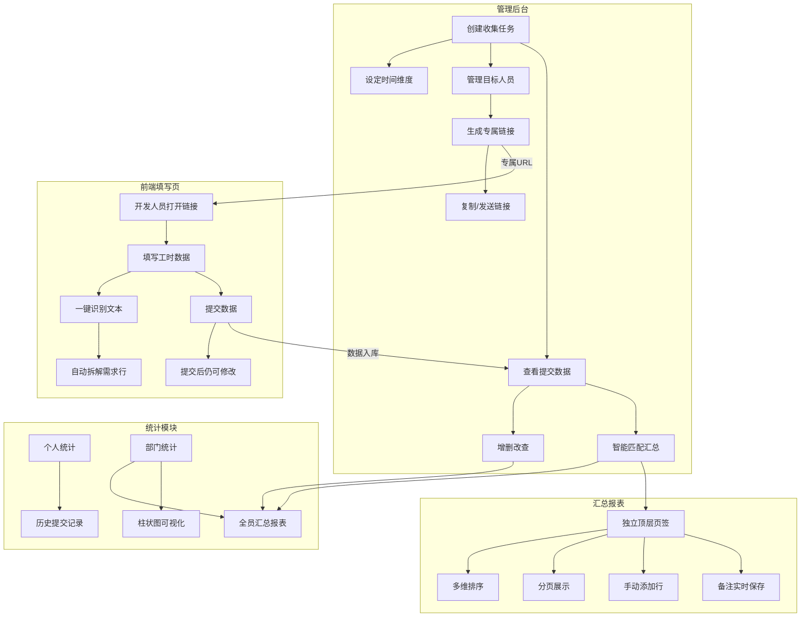
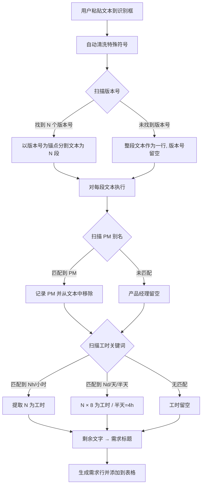

# DevTracker — 开发人员工时统计系统 · 需求基准文档

> **版本**：v0.5.0 | **日期**：2026-04-15  
> **文档编号**：D01 | **性质**：唯一需求基准文档（融合 v0.2.0 + v0.4.0 CHG-001~029 + 后续对话微调）

---

## 一、项目概述

### 1.1 项目背景

团队需要一套轻量化的工时统计工具，用于收集各开发人员（前端/后端/测试）在指定时间段内的工作内容，并自动汇总生成结构化的需求维度报表。

### 1.2 核心目标

- **便捷采集**：管理员生成链接 → 分发给开发人员 → 各自填写提交
- **智能汇总**：对不同角色提交的相同需求进行模糊匹配，自动归并
- **多维统计**：支持个人历史记录查看和部门整体统计

### 1.3 用户角色

| 角色 | 权限 |
|:---|:---|
| **管理员** | 后台管理、创建任务、管理人员名单、查看统计报表、增删改查数据 |
| **开发人员** | 通过专属链接填写工时、查看个人历史统计 |

---

## 二、系统架构


```mermaid
graph TB
    subgraph 管理后台
        A[创建收集任务] --> B[设定时间维度]
        A --> C[管理目标人员]
        C --> D[生成专属链接]
        D --> E[复制/发送链接]
        A --> F[查看提交数据]
        F --> G[增删改查]
        F --> H[智能匹配汇总]
    end

    subgraph 前端填写页
        I[开发人员打开链接] --> J[填写工时数据]
        J --> J1[一键识别文本]
        J1 --> J2[自动拆解需求行]
        J --> K[提交数据]
        K --> L[提交后仍可修改]
    end

    subgraph 统计模块
        M[个人统计] --> N[历史提交记录]
        O[部门统计] --> P[全员汇总报表]
        O --> Q[柱状图可视化]
        H --> P
    end

    subgraph 汇总报表
        R[独立顶层页签] --> S[多维排序]
        R --> T[分页展示]
        R --> U[手动添加行]
        R --> V[备注实时保存]
    end

    D -->|专属URL| I
    K -->|数据入库| F
    G --> P
    H --> R
```

### 2.1 全局导航结构

```
任务清单 | 汇总报表 | 周期统计        [新建收集] [管理员] [团]
```

**导航规则**：
- 主导航三项：**任务清单** (`#/tasks`) → **汇总报表** (`#/report`) → **周期统计** (`#/stats`)
- **团队人员** (`#/personnel`) 通过 Header 右侧「团」圆形徽章进入（不占用主导航位）
- 二级页面（任务详情 `#/task/:id`、团队人员 `#/personnel`）显示 **返回按钮**
- 页面标题：`研发效能度量 - DevTracker`

### 2.2 全系统链接协议兼容（REQ-039）

- 生产环境必须同时支持 `http://jfzhu8023.cloud/devtracker/` 与 `https://jfzhu8023.cloud/devtracker/`。
- 所有 Vue History 模式路由深链必须在 HTTP/HTTPS 下直接访问：`/tasks`、`/tasks/:id`、`/report`、`/stats`、`/personnel`、`/permissions`、`/settings`、`/fill/:token`、`/pm/view/:token`、`/access?token=...`、`/403`。
- `/devtracker` 无尾斜杠访问必须重定向到 `/devtracker/`，并保留原 query 参数。
- 前端生成、复制、打开的所有系统链接必须按当前页面协议生成：HTTP 页面生成 HTTP 链接，HTTPS 页面生成 HTTPS 链接。
- `/devtracker/api/*` 在 HTTP/HTTPS 下都必须代理到 DevTracker 后端 `/api/*`，不得被其他项目的 catch-all 路由拦截。

---

## 三、功能模块详细设计

### 3.1 任务清单 (`#/tasks`)

#### 3.1.1 创建收集任务

- 管理员点击「新建收集」按钮
- 弹窗采用**左右双栏布局**：
  - 左侧：时间维度选择 + 参考日期 + 任务预览 + 快捷周期列表
  - 右侧：日历面板（高亮选中范围）
- 选择时间维度：日 / 周（默认上周）/ 半月 / 月 / 季度 / 半年 / 年
- 日历与表单**双向实时联动**：
  - 表单选维度/日期 → 日历高亮对应日期范围
  - 日历点击日期 → 表单自动更新为该日所在周
  - 快捷列表点击 → 表单和日历同步更新
- 若日历选中范围超出当前维度范畴，维度显示为"其他"
- 系统自动生成任务标题，如：`2026年04月06日-2026年04月12日，本年度第15周工作统计`

#### 3.1.2 任务列表展示

按 **年度 → 季度** 两级层级结构展示，季度标签显示 Q 徽章（如 Q2）。

**列结构**：

| 列 | 宽度 | 说明 |
|:---|:---|:---|
| 时间范围 | 100px | 上下双行以 `\|` 间隔显示起止日期 |
| 任务标题 | 自适应 | 任务名称，加粗 |
| 维度 | 100px | 灰色 Tag 标签 |
| 记录数 | 80px | 该任务下的提交记录总数 |
| 状态 | 100px | 收集中（绿色）/ 已归档（灰色）/ 草稿 |
| 操作 | 80px | 蓝色「查看」按钮，点击跳转到任务详情 |

**特殊规则**：
- **最近一笔任务着重显示**：按 `createdAt` 排序最新一条，左侧显示 3px 主色竖条，背景微染 `#E8F3FF`
- 行高紧凑化：行内边距 `padding: 8px 24px`
- 点击整行或「查看」按钮均可进入任务详情

---

### 3.2 单任务详情页 (`#/task/:id`)

进入单条任务后，页面顶部显示面包屑导航（任务清单 › 当前任务标题），下方为**三 Tab 切换**：

#### 3.2.1 提交数据 Tab

**列结构**：

| 列序 | 列名 | 说明 |
|:---:|:---|:---|
| 1 | 序号 | 自增 |
| 2 | 人员 | 姓名加粗 |
| 3 | 角色 | 彩色 Tag（前端蓝/后端绿/测试橙） |
| 4 | 版本号 | 等宽字体 |
| 5 | 需求标题 | 主信息 |
| 6 | 产品经理 | 逗号分隔 |
| 7 | 工时(h) | 主色加粗 |
| 8 | 提交时间 | `createdAt` |
| 9 | 最新修改时间 | `updatedAt` |
| 10 | 操作 | 编辑 / 删除 |

**排序规则**：按 `staffId` 分组（同名挨在一起），组内按 `createdAt` 正序。

**内联编辑**：点击「编辑」按钮后，该行可编辑字段变为 `<input>` 控件，按钮变为「保存」。保存后更新 Store 并重新渲染。

**删除**：点击「删除」按钮后，确认后从 Store 中移除记录并刷新列表。

#### 3.2.2 链接管理 Tab

**预设通知文本框**：表格上方新增 `<textarea>` 多行文本域。
- 默认值："请填写本周工作内容，链接如下："
- 点击「复制」或「发送」时，内容 = 预设文本 + 换行 + 对应的专属链接。

**列结构**：

| 列 | 说明 |
|:---|:---|
| 人员 | 加粗 |
| 角色 | 彩色 Tag |
| 专属链接 | 渲染为可点击的 `<a>` 标签，直接跳转到填写页 |
| 提交状态 | 已提交（绿）/ 未提交（灰） |
| 操作 | 「复制」和「发送」按钮 |

**发送行为**（Demo 阶段）：点击「发送」执行 `showToast('已通过钉钉发送给 xxx')`。正式版通过 `dingtalk://` 协议打开钉钉聊天窗口。

#### 3.2.3 汇总报表 Tab（快捷入口）

作为该任务下的汇总报表快捷入口，数据内容与独立的「汇总报表」页签一致，但固定显示当前任务的数据（无需任务选择器）。

---

### 3.3 前端填写页 (`#/fill/:token`)

#### 3.3.1 页面布局

- 独立布局（隐藏管理端导航和侧边栏）
- 宽度：两侧各留 `100px` 留白，其余铺满
- 纸张式白色画布居中

#### 3.3.2 页面标题

动态格式：`xxxx年xx月xx日，本年度第xx周工作统计`  
副标题：`【前端/后端/测试】张三 工作内容填写`

#### 3.3.3 一键识别文本框 ⚡

在填写表格上方新增「一键识别」文本域，用户粘贴自然语言文本后系统自动拆解并回填到表格：

**识别规则引擎（按优先级）**：

| 优先级 | 目标字段 | 识别规则 |
|:---:|:---|:---|
| 1 | 版本号 | 以 `V/v` 开头 + 数字 + `.` + 数字 + `.` + 数字 的连续串。最高优先。 |
| 2 | 版本号（备选） | 无 V 前缀但包含两个小数点的连续数字串（如 `4.633.0`），自动补 `V` 前缀。 |
| 3 | 工时（小时） | `0.5-24` 范围的数字后紧跟 `小时/h/H/时`。如 `5h` → 5.00h。支持小数如 `1.5h`。 |
| 4 | 工时（天转换） | `0.5-7` 范围的数字后紧跟 `D/d/天/日`（含小数如 `1.5天`、含斜杠如 `2.5/天`）。提取数字 × 8 = 工时。`半天` = 4h。 |
| 5 | 产品经理 | 扫描文本中是否包含 PM 名称的全称或别名，匹配后自动回填产品经理字段。 |
| 6 | 需求标题 | 去除版本号、工时关键词和 PM 名称后的剩余纯文字描述，自动去除首尾标点和空白。 |

**产品经理智能匹配规则**：

系统在每个文本段中扫描以下别名。全名优先匹配（避免单字误匹配），匹配后自动从标题中移除已识别的人名文字。

| PM 全名 | 可匹配的别名（含全名） |
|:---|:---|
| 钟冠 | 钟冠、钟、冠 |
| 吴浩鑫 | 吴浩鑫、浩鑫、吴、鑫 |
| 杨瑞 | 杨瑞、杨、瑞 |
| 罗晓璇 | 罗晓璇、晓璇、罗、璇 |
| 其他-昆仑 | 昆仑 |
| 其他-短信 | 短信 |
| 其他-架构 | 架构 |

**特殊符号自动清洗**：
- **保留**：中文标点 `，。；！【】`、括号 `(){}[]（）`、常用符号 `@#%&=`
- **移除**：所有其他特殊符号（如 `★※☆◆●▶◇△` 等装饰符号）

**多版本号处理**：若输入包含多个版本号，以版本号为锚点分割文本为多段，每段生成一个独立的需求行。

**无单位兜底数字**：行尾独立数字默认为**小时**（非天），范围 0.5~200。

**多行文本处理**：支持换行符分割，每行独立识别。


```mermaid
flowchart TD
    A[用户粘贴文本到识别框] --> A1[自动清洗特殊符号]
    A1 --> B{扫描版本号}
    B -->|找到 N 个版本号| C[以版本号为锚点分割文本为 N 段]
    B -->|未找到版本号| D[整段文本作为一行, 版本号留空]
    C --> E[对每段文本执行]
    D --> E
    E --> E1{扫描 PM 别名}
    E1 -->|匹配到 PM| E2[记录 PM 并从文本中移除]
    E1 -->|未匹配| E3[产品经理留空]
    E2 --> F{扫描工时关键词}
    E3 --> F
    F -->|匹配到 Nh/小时| G[提取 N 为工时]
    F -->|匹配到 Nd/天/半天| H["N × 8 为工时 / 半天=4h"]
    F -->|无匹配| I[工时留空]
    G --> J[剩余文字 → 需求标题]
    H --> J
    I --> J
    J --> K[生成需求行并添加到表格]
```

#### 3.3.4 填写表格

| 字段 | 类型 | 说明 |
|:---|:---|:---|
| 序号 | 自动 | 自增序号 |
| 需求标题 | 文本输入 | 手动输入需求名称 |
| 版本号 | 文本输入 | 如 V2.333.0 |
| 需求产品人员 | 自定义下拉多选 | 选中后以 Tag 标签展示，支持单选/多选 |
| 工时（小时） | 数字输入 | 精确到**小数点后两位**，步长 0.01，范围 0.01-200 |

**交互功能**：
- 「+ 新增需求行」按钮
- 每行有删除按钮
- 「暂存草稿」和「提交」按钮
- 提交后仍可修改

---

### 3.4 汇总报表页 (`#/report`) ⚡

> **独立为顶层主导航页签（第二项）**

#### 3.4.1 页面结构

```
┌─────────────────────────────────────────────────────┐
│ [任务周期选择器]                  总工时: XXX h      │
├─────────────────────────────────────────────────────┤
│ [新增行] [排序: PM(默认) | 前端 | 后端 | 测试]       │
├──┬──────┬─────────┬──────┬────┬────┬────┬──────┬────┤
│序│版本号│需求名称  │产品PM│前端│后端│测试│总计/h│备注│
│  │      │(加宽)   │      │人/h│人/h│人/h│      │可编│
├──┼──────┼─────────┼──────┼────┼────┼────┼──────┼────┤
│..|......|.........|......|....|....|....|......|....│
├──┴──────┴─────────┴──────┼────┼────┼────┼──────┤    │
│                   列合计 │ XX │ XX │ XX │ XXX  │    │
├──────────────────────────┴────┴────┴────┴──────┴────┤
│ [分页: < 1 2 3 ... >]              每页 20 条       │
└─────────────────────────────────────────────────────┘
```

#### 3.4.2 列结构

| 列序 | 列名 | 宽度 | 说明 |
|:---:|:---|:---|:---|
| 1 | 序号 | 40px | 自增 |
| 2 | 版本号 | 100px | 等宽字体 |
| 3 | 需求名称 | **加宽**/自适应 | 主信息 |
| 4 | 产品经理 | 120px | |
| 5 | 前端（人员/工时） | **缩窄** | 人员名 + 工时 |
| 6 | 后端（人员/工时） | **缩窄** | 人员名 + 工时 |
| 7 | 测试（人员/工时） | **缩窄** | 人员名 + 工时 |
| 8 | 工时总计/h | 100px | 前端+后端+测试之和 |
| 9 | 备注 | 150px | 可编辑输入，blur 事件自动保存 |

#### 3.4.3 排序规则

- **默认排序**：按产品经理名称分组（同名 PM 排列在一起），组内按版本号排列
- **可切换排序**：点击「前端」/「后端」/「测试」按钮，按该角色人员姓名的**拼音首字母**排序（同名人员排列相邻），使用 `localeCompare('zh-Hans')`
- 当前激活的排序按钮以主色高亮

#### 3.4.4 工时总计体系

- 每行末尾的「工时总计/h」列 = 该行前端+后端+测试工时之和
- 表格底部**每个工时列**显示该列所有行的合计
- **表格右上角**显示当前列表全部记录的工时总数

#### 3.4.5 可编辑备注

- 每行渲染为 `<input type="text">`
- `blur` 事件触发自动保存到 localStorage

#### 3.4.6 手动添加行

页面上方「新增行」按钮，点击后在列表顶部添加空白行，可手动填写，实时统计到各总计。

#### 3.4.7 分页

- 单页默认显示 **20 条**
- 底部显示分页控件（上一页 / 页码 / 下一页）
- 切换页码时平滑刷新数据区域

#### 3.4.8 字体规范

表格内文字 `14px`，表头 `13px`（相比其他表格加大）。

---

### 3.5 周期统计 (`#/stats`)

#### 3.5.1 部门全观

**筛选器**：
- 年度选择器：默认当前年（2026）
- 季度选择器：Q1/Q2/Q3/Q4，默认当前季度
- 任务周期选择器：季度下的全部收集任务，默认"全部周期"
- 三级联动：切换筛选后触发数据重新过滤与渲染

**统计概要卡片**：

| 卡片 | 数据来源 |
|:---|:---|
| 当前季度总工时/小时 | 筛选后的前端+后端+测试全部工时合计 |
| 提交记录数 | 筛选范围内已提交的需求记录总数 |
| 研发人员 | 含前端/后端/测试的人员数量 |
| 收集任务数 | 筛选范围内的收集任务数量 |

**部门汇总明细表**：

| 列 | 说明 |
|:---|:---|
| 序号 | 自增 |
| 版本号 | 等宽字体 |
| 需求名称 | 主信息 |
| 产品经理 | |
| 前端累计工时 | 该需求下所有前端人员工时之和（纯数值） |
| 后端累计工时 | 该需求下所有后端人员工时之和（纯数值） |
| 测试累计工时 | 该需求下所有测试人员工时之和（纯数值） |

**柱状图** ⚡：

- 类型：分组柱状图（Grouped Bar Chart）
- X 轴：每个产品经理名称
- Y 轴：工时数
- 技术方案：Canvas 2D API 原生绘制（零依赖）
- 每个 PM 显示 4 组柱形：

| 柱形 | 颜色 | 说明 |
|:---|:---|:---|
| 前端总计 | `#165DFF`（蓝） | 该 PM 下所有需求的前端工时之和 |
| 后端总计 | `#00B42A`（绿） | 该 PM 下所有需求的后端工时之和 |
| 测试总计 | `#FF7D00`（橙） | 该 PM 下所有需求的测试工时之和 |
| 总计 | `#F53F3F`（红） | 前端+后端+测试总和 |

- 柱顶标注：每个柱形顶部显示**加粗的实际数值**
- Canvas 宽度自适应容器，高度固定 360px

#### 3.5.2 个人聚焦

**人员选择方式**：所有角色的人员在**同一行内水平平铺**，每人前有角色色标（蓝/绿/橙圆点），无需按角色分行。

**个人概要卡片**：头像 + 姓名 + 角色 Tag + 总工时/记录数/参与周期数。

**参与任务列表**：可折叠手风琴面板（Accordion），默认收起，点击展开查看该任务周期下的详细记录。

#### 3.5.3 自然周快捷选择（REQ-040）

- 工时数据分析报告顶部“粒度”下拉只展示：`全部`、`年度`、`季度`、`月份`。
- 周维度不再作为粒度下拉项展示；周数据通过“自然周”快捷按钮进入。
- `全部`、`年度`、`季度`、`月份`范围内都必须显示按年度自然周计算的自然周按钮。
- 自然周按钮最多显示 9 个，左右存在隐藏自然周时展示 `《` / `》`；点击 `《` 向左移动 2 个按钮，点击 `》` 向右移动 2 个按钮。
- 某自然周未生成收集任务时，按钮灰色禁用且不可点击。
- 某自然周已生成收集任务但没有统计数据时，按钮蓝色边框禁用且不可点击。
- 某自然周有统计数据时，按钮正常显示且可点击，点击后进入该周统计范围。
- 默认仅当前有效自然周显示底部淡蓝色三角；若点击进入某一周，则仅该周显示底部淡蓝色三角，其他按钮不显示三角。
- 点击自然周只切换当前粒度/周期备选周范围内的具体周统计数据，不得改变“粒度”和“周期”下拉框当前选项。
- 周期统计页与本地工时数据分析报告的自然周按钮状态规则保持一致。

#### 3.5.4 回到顶部（REQ-041）

- 周期统计（季度）页面在向下滚动超过首屏一定距离后，右下角显示“回到顶部”按钮。
- 按钮固定在视口右下角，不参与页面内容布局，不得挤压或遮挡统计卡片、表格、Tab 和图表主体。
- 点击按钮后页面回到顶部，回到顶部后按钮自动隐藏。

---

### 3.6 团队人员管理 (`#/personnel`)

- 通过 Header 右侧「团」圆形徽章进入
- 二级页面，显示返回按钮
- 维护开发人员名单（姓名 + 角色：前端/后端/测试）
- 支持增删改：
  - **新增**：弹窗输入姓名和选择角色
  - **编辑**：弹窗修改姓名/角色
  - **删除**：确认后从 Store 移除
- 每次「生成链接」时，为名单内每个人生成独立的填写链接

---

### 3.7 智能匹配与汇总

**匹配规则**：

1. **版本号完全匹配**（权重 0.3）：版本号相同的需求优先归为同一组
2. **需求标题模糊匹配**（权重 0.5）：Jaccard + 编辑距离取最大值
3. **产品经理匹配**（权重 0.2）：同一产品经理 → 加分
4. **人工确认**：置信度低于 0.7 时标记为待确认

**匹配阈值**：

| 置信度范围 | 处理方式 |
|:---:|:---|
| ≥ 0.7 | 自动归并 `auto_merged` |
| 0.5 ~ 0.7 | 待确认 `pending_review` |
| < 0.5 | 保持独立 |

---

## 四、数据模型

### 4.1 收集任务（CollectionTask）

```json
{
  "id": "string (UUID)",
  "title": "string (自动生成)",
  "timeDimension": "enum: day | week | half_month | month | quarter | half_year | year",
  "startDate": "date (YYYY-MM-DD)",
  "endDate": "date (YYYY-MM-DD)",
  "weekNumber": "number",
  "year": "number",
  "status": "enum: draft | active | closed",
  "createdAt": "datetime",
  "updatedAt": "datetime"
}
```

### 4.2 人员（Staff）

```json
{
  "id": "string (UUID)",
  "name": "string",
  "role": "enum: frontend | backend | test",
  "isActive": "boolean",
  "createdAt": "datetime"
}
```

### 4.3 填写链接（FillLink）

```json
{
  "id": "string (UUID)",
  "taskId": "string (FK → CollectionTask.id)",
  "staffId": "string (FK → Staff.id)",
  "token": "string (唯一令牌)",
  "url": "string",
  "isSubmitted": "boolean",
  "createdAt": "datetime"
}
```

### 4.4 工时记录（WorkRecord）

```json
{
  "id": "string (UUID)",
  "linkId": "string (FK → FillLink.id)",
  "taskId": "string (FK → CollectionTask.id)",
  "staffId": "string (FK → Staff.id)",
  "requirementTitle": "string",
  "version": "string (如 V2.333.0)",
  "productManagers": "string[]",
  "hours": "number (精确到小数点后两位)",
  "createdAt": "datetime",
  "updatedAt": "datetime"
}
```

### 4.5 匹配组（MatchGroup）

```json
{
  "id": "string (UUID)",
  "taskId": "string (FK → CollectionTask.id)",
  "mergedTitle": "string",
  "version": "string",
  "productManagers": "string[]",
  "frontend": [{ "staffName": "string", "hours": "number" }],
  "backend": [{ "staffName": "string", "hours": "number" }],
  "test": [{ "staffName": "string", "hours": "number" }],
  "remark": "string",
  "confidence": "number (0~1)",
  "status": "enum: auto_merged | pending_review | manual_merged"
}
```

---

## 五、API 接口规范（RESTful，正式版预留）

| 方法 | 路径 | 说明 |
|:---|:---|:---|
| `GET` | `/api/tasks` | 获取所有收集任务 |
| `POST` | `/api/tasks` | 创建收集任务 |
| `GET` | `/api/tasks/:id` | 获取单个任务详情 |
| `PUT` | `/api/tasks/:id` | 更新任务 |
| `DELETE` | `/api/tasks/:id` | 删除任务 |
| `GET` | `/api/staff` | 获取人员列表 |
| `POST` | `/api/staff` | 新增人员 |
| `PUT` | `/api/staff/:id` | 更新人员信息 |
| `DELETE` | `/api/staff/:id` | 删除人员 |
| `POST` | `/api/tasks/:taskId/generate-links` | 生成所有人员链接 |
| `GET` | `/api/fill/:token` | 通过令牌获取填写页面数据 |
| `POST` | `/api/fill/:token/records` | 提交/更新工时记录 |
| `GET` | `/api/stats/personal/:staffId` | 个人历史统计 |
| `GET` | `/api/stats/department?taskId=xxx` | 部门统计 |
| `POST` | `/api/tasks/:taskId/match` | 执行智能匹配 |
| `GET` | `/api/report?taskId=xxx` | 汇总报表数据 |

---

## 六、前端组件树

```
App
├── AdminPanel（管理后台）
│   ├── TaskList（任务清单 — 季度分组 + 最新任务高亮）
│   │   ├── TaskCard（任务行，含查看按钮）
│   │   └── CreateTaskModal（创建任务弹窗 — 左右双栏+日历）
│   ├── TaskDetail（单任务详情 — 三Tab切换）
│   │   ├── RecordsTab（提交数据 — 内联编辑 + 删除）
│   │   ├── LinksTab（链接管理 — 预设文本+发送）
│   │   └── SummaryTab（汇总报表快捷入口）
│   ├── ReportPage（汇总报表 — 独立顶层页签）
│   │   ├── TaskSelector（任务选择器）
│   │   ├── SortControls（排序切换）
│   │   ├── ReportTable（数据表格 + 底部合计 + 备注）
│   │   ├── Pagination（分页控件）
│   │   └── AddRowButton（新增行）
│   ├── StatsPage（周期统计 — 部门/个人双Tab）
│   │   ├── DeptStats（部门全观 — 联动筛选器+卡片+明细表+柱状图）
│   │   │   ├── FilterBar（年度/季度/周期三级联动筛选器）
│   │   │   ├── StatCards（概要卡片）
│   │   │   ├── DeptTable（累计工时明细表）
│   │   │   └── BarChart（Canvas 柱状图）
│   │   └── PersonalStats（个人聚焦 — 单行平铺+折叠面板）
│   └── PersonnelPage（团队人员 — 通过徽章进入）
│
└── FillPage（填写页面 — 独立布局）
    ├── FillHeader（标题区）
    ├── TextRecognizer（一键识别文本框）
    ├── FillTable（填写表格 — 自定义多选下拉）
    └── SubmitBar（提交/草稿区）
```

---

## 七、状态管理（Demo 阶段）

**localStorage Key 命名规范**：

| Key | 类型 | 说明 |
|:---|:---|:---|
| `dt_tasks` | `CollectionTask[]` | 收集任务列表 |
| `dt_staff` | `Staff[]` | 人员名单 |
| `dt_links` | `FillLink[]` | 填写链接 |
| `dt_records` | `WorkRecord[]` | 工时记录 |
| `dt_match_groups` | `MatchGroup[]` | 匹配组 |
| `dt_remarks` | `{ [groupId]: string }` | 汇总报表备注 |
| `dt_demo_version` | `string` | Demo 数据版本号 |

---

## 八、UI/UX 规范

### 8.1 色彩系统（东方高定 · 字节 Semi 标准）

| 用途 | 色值 | 说明 |
|:---|:---|:---|
| 主色 | `#165DFF` | 菁英蓝 |
| 主色悬浮 | `#4080FF` | 悬浮态 |
| 主色浅底 | `#E8F3FF` | 选中背景 |
| 成功色 | `#00B42A` | 绿 |
| 警告色 | `#FF7D00` | 橙 |
| 危险色 | `#F53F3F` | 红 |
| 文本强调 | `#1D2129` | 标题 |
| 文本常规 | `#4E5969` | 正文 |
| 文本次要 | `#86909C` | 占位符 |
| 边框 | `#E5E6EB` | 分割线 |
| 背景 | `#F2F3F5` | 页面底色 |

### 8.2 字体

- 主字体：`-apple-system, BlinkMacSystemFont, "PingFang SC", "Microsoft YaHei", "Helvetica Neue", Arial, sans-serif`
- 等宽字体：`"JetBrains Mono", Consolas, "PingFang SC", monospace`

### 8.3 动画规范

- 基础过渡：`all 0.25s cubic-bezier(0.34, 0.69, 0.1, 1)`
- 弹窗过渡：`all 0.3s cubic-bezier(0.34, 0.69, 0.1, 1)`

---

## 九、时间维度说明

| 维度 | 计算方式 |
|:---|:---|
| 日 | 指定某一天 |
| 周（默认） | 默认上周一至上周日 |
| 半月 | 1-15日 或 16日-月末 |
| 月 | 自然月 |
| 季度 | Q1(1-3月) Q2(4-6月) Q3(7-9月) Q4(10-12月) |
| 半年 | H1(1-6月) H2(7-12月) |
| 年 | 自然年 |

---

## 十、产品经理选项列表

1. 钟冠  2. 吴浩鑫  3. 杨瑞  4. 罗晓璇  
5. 其他-昆仑  6. 其他-短信  7. 其他-架构  8. 不在上述

---

## 十一、数据校验规则

| 字段 | 校验规则 |
|:---|:---|
| 需求标题 | 必填，长度 2-200 字符 |
| 版本号 | 必填，格式 `V\d+\.\d+\.\d+` |
| 产品经理 | 必填，至少选择一项 |
| 工时 | 必填，范围 0.01-200，精确到小数点后两位 |
| 人员姓名 | 必填，长度 2-20 字符 |

---

## 十二、技术方案

### Demo 阶段（当前）

- 纯前端实现，使用 `localStorage` 模拟数据持久化
- 单页面应用，通过 Hash 路由切换视图
- HTML + CSS + Vanilla JS（零依赖）
- Canvas 2D API 绘制柱状图
- 正则字面量处理文本识别（禁止使用 `new RegExp` + 模板字符串）

### 正式开发阶段（后续）

| 层级 | 技术 |
|:---|:---|
| 前端 | Vue 3 + Element Plus |
| 后端 | Node.js (Express/Koa) 或 Java (Spring Boot) |
| 数据库 | MySQL / PostgreSQL |
| 部署 | Docker + Nginx |

---

## 十三、版本历史

| 版本 | 日期 | 变更内容 |
|:---|:---|:---|
| v0.1.0 | 2026-04-12 | Demo 初版：核心功能 |
| v0.1.1 | 2026-04-13 | 任务列表季度分组 |
| v0.1.2 | 2026-04-13 | 个人统计重构 |
| v0.2.0 | 2026-04-13 | 同岗位并列显示 + 日历联动 |
| v0.3.0 | 2026-04-13 | 全量 Demo UI 重构（东方高定风格） |
| v0.4.0 | 2026-04-14 | 29 项增量变更（CHG-001~029） |
| **v0.5.0** | **2026-04-15** | **文档融合 + 导航重命名（任务清单/周期统计）+ 导航重排序 + 团队徽章 + 返回按钮 + 8项功能GAP修复** |
| v0.5.1 | 2026-06-15 | 新增 REQ-039：全系统链接、跳转、复制地址、API 深链必须同时支持 HTTP/HTTPS。 |
| v0.5.2 | 2026-06-28 | 新增 REQ-040：周期统计页与工时数据分析报告自然周快捷按钮状态、移动和三角指示规则。 |
| v0.5.3 | 2026-06-28 | 新增 REQ-041：周期统计（季度）页面回到顶部按钮。 |
| v0.5.4 | 2026-09-01 | 新增 REQ-042：自动任务与通知失败后每 5 分钟重试、单笔最多尝试 3 次，并严格保护任务生成幂等。 |
| v0.5.5 | 2026-09-01 | 新增 REQ-043：全年日历日期格与详情标题显示“特/跳/换”角标，日期规则默认展示当天完整详情。 |
| v0.5.6 | 2026-09-01 | 新增 REQ-044：自动任务规则历史默认展开最近20条，支持按规则翻页及10至1000条固定页容量。 |
| v0.5.7 | 2026-09-01 | 修订 REQ-044：执行记录首次进入默认收起，展开后显示最近20条及分页。 |
| v0.5.8 | 2026-09-02 | 新增 REQ-045：所有钉钉群机器人 webhook 推送入口统一使用兼容、安全的发送链路。 |
| v0.5.9 | 2026-09-08 | 修订 REQ-046：当天开始通知成功但值班未完成时，允许临时换班。 |
| v0.6.0 | 2026-09-08 | 新增 REQ-047：工时数据分析报告“版本”页支持按人员、岗位、版本号去重筛选及按当前页面结果导出 Excel。 |
| v0.7.0 | 2026-09-12 | 新增 REQ-048：AI产品经理工时填报、产研统一角色、交付进度统计与冲突数据双页签。 |
| v0.7.1 | 2026-09-12 | 确认 REQ-048：嵌入式统一显示名、所有新记录强制进度、综合进度采用工时加权、研发与产品工时独立存储。 |
| v0.7.2 | 2026-09-12 | 确认 REQ-048 工时加权执行，并要求所有加权结果位置提供公式、有效工时、空进度规则和示例 Tips。 |
| v0.7.3 | 2026-09-12 | 确认 REQ-048 需求方允许多选；同一条工时多选只保存一次工时，按需求方拆分展示但不重复计入总工时。 |
| v0.7.4 | 2026-09-12 | 新增 REQ-049 草案：AI产品经理工时来源隔离、历史进度显示、需求方图表和 AI研发人员工时页签；待用户确认后开发。 |
| 需求变更 | 2026-09-17 | 新增 REQ-064：按已批准研究演示最小开发有效工时、加权交付率、五类工时固定版本、当前非离职且范围内有记录人员过滤；四轮冻结文档归档，执行验收待完成。 |
| 需求纠正 | 2026-09-17 | 新增 REQ-065：统计加权交付率改除以有效工时，历史空进度计算按100且不回填、显式0仍0，新普通进度10..100，卡片及详情四指标同行；填写预估加权完成度仍除以应填容量。 |

---

## 十四、需求编号索引

| 编号 | 需求 | 状态 |
|:---|:---|:---:|
| REQ-001 | 创建收集任务（含日历联动） | ✅ |
| REQ-002 | 任务清单（季度分组 + 查看按钮 + 最新高亮 + 紧凑行高） | ✅ |
| REQ-003 | 人员名单管理（增删改） | 🔧 |
| REQ-004 | 数据管理（版本号前置 + 人员分组 + 时间列 + 内联编辑 + 删除） | 🔧 |
| REQ-005 | 智能匹配与汇总 | ✅ |
| REQ-006 | 前端填写页（宽度铺满 + 自定义多选 + 两位小数） | 🔧 |
| REQ-007 | 部门统计（联动筛选器 + 累计工时表 + 柱状图） | 🔧 |
| REQ-008 | 个人统计（单行平铺 + 可折叠） | ✅ |
| REQ-013 | 同岗位并列显示 | ✅ |
| REQ-014 | 日历联动模块 | ✅ |
| REQ-015 | 一键识别需求文本引擎 | ✅ |
| REQ-016 | 汇总报表独立页签（排序+分页+备注+总计+手动添加） | 🔧 |
| REQ-028 | 统计大盘柱状图 | ✅ |
| REQ-039 | 全系统链接 HTTP/HTTPS 兼容 | ✅ |
| REQ-040 | 自然周快捷选择状态与移动规则 | ✅ |
| REQ-041 | 周期统计页回到顶部 | ✅ |
| REQ-042 | 自动任务失败重试与任务生成幂等 | ✅ |
| REQ-043 | 日期规则角标与当天完整详情 | ✅ |
| REQ-044 | 自动任务规则历史默认收起与分页 | ✅ |
| REQ-045 | 全系统钉钉 webhook 统一适配 | ✅ |
| REQ-046 | 当天未完成值班的临时换班 | 🔧 |
| REQ-047 | 工时分析报告版本页去重筛选与页面结果导出 | 🔧 |
| REQ-048 | AI产品经理工时、产研角色统一、交付进度与双页签统计 | 📝 |
| REQ-049 | AI产品经理工时展示隔离与历史进度显示 | 🔧 |
| REQ-050 | 填写工时历史进度展示与工时分隔 | 🔧 |
| REQ-051 | 部门展示双柱状图与统计卡片无横向滚动 | 🔧 |
| REQ-052 | 需求方分配按钮状态强化 | 🔧 |
| REQ-053 | 部门双图柱宽比例统一 | 🔧 |
| REQ-054 | 部门研发柱状图单组柱宽统一 | 🔧 |
| NAV-001 | 导航重命名（任务清单/周期统计）+ 重排序 | ✅ |
| NAV-002 | 团队徽章入口 | ✅ |
| NAV-003 | 二级页面返回按钮 | ✅ |

---

## 十五、自动调度可靠性与日期规则可见性（2026-09-01）

### REQ-042 自动任务失败重试与任务生成幂等

- 自动任务执行或自动消息发送失败后，每隔 5 分钟重试一次。
- 首次执行计入次数，单笔原计划最多尝试 3 次。
- 任务创建成功后必须持久化任务 ID；后续通知重试不得再次创建任务。
- 自动任务、自动值班通知、子通知和特殊日期通知使用一致的重试上限。
- 人工测试发送不进入自动重试队列。

### REQ-043 日期规则角标与当天完整详情

- 日历日期格按当天数据显示蓝色“特”、橙色“跳”、红色“换”角标。
- 底部“特殊通知、人员跳过、临时换班”标题同步显示对应角标。
- 临时换班双方日期均须显示“换”。
- 选中日期后默认展示当天所有日期规则、排班人员、通知、跳过和换班详情。
- 详细范围、状态机与验收标准见 `docs/@demand/auto_retry_and_calendar_rule_indicators_20260901.md`。

### REQ-044 自动任务规则历史默认收起与分页

- 有历史的规则首次进入默认收起，收起态显示最近一条摘要。
- 用户展开后第 1 页显示最近 20 条合并历史。
- 超出 20 条后支持按规则独立翻页，显示总记录数。
- 每页数量只允许 `10/20/50/100/200/300/500/1000`。
- 收起后显示最新一条摘要；展开列表不得重复展示摘要记录。
- 删除历史后页码、总数和列表同步刷新。
- 详细范围与验收标准见 `docs/@demand/auto_task_history_pagination_20260901.md`。

### REQ-045 全系统钉钉 webhook 统一适配

- 所有合法的钉钉群机器人 webhook 配置均使用统一 URL 校验、DNS 安全解析、markdown 卡片构造和 HTTP 发送实现。
- 统一覆盖自动任务主通知、自动值班开始/结束通知、子通知、特殊日期通知、页面测试发送和失败重试。
- 同一规则支持单连接、多连接、旧版字符串配置和当前结构化配置，不得只对某个固定 token 或固定规则生效。
- 当前及后续 Node.js 运行时请求单地址或地址数组时均须正确回调，同时继续拒绝私网、环回和非钉钉官方生产地址。
- 多连接必须逐一尝试；部分目标失败时继续发送其他目标，并按既有规则汇总失败目标。
- 钉钉返回 `400104` 等机器人停用状态时必须透传可识别错误，不得伪报成功或尝试绕过平台控制。
- 完整诊断、实现与验证见 `docs/@development/dingtalk_webhook_local_dns_compatibility_20260902.md`。

### REQ-046 当天未完成值班的临时换班

- 临时换班不再以“开始提醒是否已有成功日志”作为锁定条件。
- 当天开始提醒已发送但尚未达到该日配置的 `end_time` 时，允许新增、编辑和取消临时换班。
- 当前日期达到 `end_time`、当天已成功发送结束提醒，或目标日期已早于当前北京日期时，禁止新增、编辑和取消该日期相关的临时换班。
- 对只发送开始提醒的规则，仍以配置的 `end_time` 作为当天值班完成边界；不因不存在结束提醒而永久可改。
- 已发出的开始提醒不撤回、不重发；保存后尚未触发的结束提醒、日历预览和后续值班展示统一使用最新最终值班人员。
- 年度日历保存携带的未变更历史换班记录只保留，不得被重新写入或因保存其他配置而自动取消。

### REQ-047 工时分析报告版本页去重筛选与页面结果导出（2026-09-08）

- 在“工时数据分析报告”的“版本”页增加人员、岗位、版本号三个筛选条件；三个条件的可选值均来自当前报告快照，并按实际值去重。
- 筛选支持单条件和多条件组合；默认均为“全部”，清空或重置后恢复当前报告的全量版本结果。
- 版本汇总结果按版本号去重，每个版本号只显示一行，并显示版本名称、总工时、占比、各岗位工时、记录数、需求数和人员数。
- 页面同时显示“人员 + 岗位 + 版本号”去重结果，每个组合只显示一行，并显示总工时、来源记录数、需求数和覆盖周期数。
- 筛选后的版本图表、版本汇总和组合汇总必须同步刷新；无匹配结果时显示明确的空状态，不保留旧结果。
- “导出 Excel”只导出当前版本页筛选结果，至少包含导出说明、版本汇总、人员岗位版本汇总和筛选来源记录四个工作表；导出结果须保留当前筛选条件、统计范围、去重口径和工时合计。
- 导出接口只读当前报告快照，不执行数据库写入、不导入本地数据、不改变生产数据；服务端使用统一的 `xlsx` 依赖生成 `.xlsx` 文件。
- 版本页已有的周期切换、历史数据可查、角色动态配置和离职人员统计口径不得被改变。
- 详细页面布局、接口契约、去重口径和验收矩阵见 `docs/@demand/workload_report_version_filter_export_20260908.md`。

### REQ-048 AI产品经理工时、产研角色统一、交付进度与双页签统计（2026-09-12）

- 团队人员页面统一使用“新增产研人员”；角色目录包含 AI产品经理、AI开发工程师、VOIP工程师、AI质量工程师、嵌入式工程师。现有 `embedded` 角色键保持兼容，历史“嵌入式软件工程师”记录不得丢失，统一显示为“嵌入式工程师”。
- AI产品经理可像研发人员一样填写工时，但 AI产品经理工时进入独立的产品工时存储，不与研发 `work_records` 混写；统计接口可统一返回，但必须保留来源类型和原始存储边界。
- AI产品经理填报表的“AI产品经理”列改为“需求方”，每行允许多选：内部需求、客户需求、对外服务、其他需求；“对外服务”包含售前、运营、业务培训等服务性工作。多选只保存该行一次工时，统计总工时不得因多选重复累加。
- AI产品经理支持逐行粘贴文本识别，需明确版本号、需求标题、需求方、工时的分隔和校验规则；识别失败不得静默保存。
- 周期统计（季度）角色卡片横向自适应，顺序为总工时、AI产品经理、其他岗位；不产生横向滚动条，缩放和窄屏下文字完整可读。
- 统计中当 AI产品经理数据与原有研发/岗位数据存在展示冲突时，采用默认选中“非AI产品经理”页签与“AI产品经理”页签分离展示；无冲突字段可并列展示。
- 所有角色的新填报行均在操作列之前增加必填“交付进度”，仅允许 0%、10%、20%、30%、40%、50%、60%、70%、80%、90%、100%，默认空值；AI产品经理页面在“需求方”和“工时/h”之后显示该列，历史记录不回填、不强制补录。
- 周期统计岗位卡片增加综合进度展示；点击卡片打开总览和“需求进度”两个页签，按人员展示查询范围内总进度与任务明细。含版本号、无版本号需求分开统计和展示；100%任务显示“已完成100%”并使用绿色背景。
- 需求进度综合值采用工时加权平均：`综合进度 = Σ(每条有效工时 × 该条进度) ÷ Σ(有效工时)`；历史无进度记录不伪造为0%，不进入有效进度分母，并单独展示“未填写”。同时展示完成/部分完成/未开始任务数量，避免仅用任务数量造成大任务与小任务失真。
- 所有使用工时加权的卡片、弹窗、列表、图表和导出说明必须提供统一 Tips；Tips 至少说明公式、有效工时范围、历史空进度不进分母的规则，以及“10小时100% + 2小时50% = 91.67%”示例。
- 详细需求、四轮反哺文档、开发计划和测试用例见：`docs/@demand/ai_product_manager_workload_and_progress_20260912.md`、`docs/@plan/ai_product_manager_workload_and_progress_20260912.md`、`docs/@test/ai_product_manager_workload_and_progress_20260912/`。

### REQ-049 AI产品经理工时展示隔离与历史进度显示（2026-09-12）

- 历史有交付进度显示真实百分比，历史没有填写显示 `-`。
- 研发图表继续使用 AI产品经理归属人维度；AI产品经理工时使用需求方维度，二者不混图。
- 部门全观增加 AI产品经理需求方补充图，并增加“AI产品经理工时”“AI研发人员工时”页签。
- 详细四轮反哺需求、开发计划和测试用例见：`docs/@demand/ai_pm_stats_source_separation_20260912.md`、`docs/@demand/ai_pm_stats_source_separation_20260912_r2.md`、`docs/@demand/ai_pm_stats_source_separation_20260912_r3.md`、`docs/@demand/ai_pm_stats_source_separation_20260912_r4.md`、`docs/@plan/ai_pm_stats_source_separation_20260912.md`、`docs/@test/ai_pm_stats_source_separation_20260912/`。

#### REQ-049-UI-01 统计页双视图展示对齐（2026-09-12）

- AI产品经理工时页顶部卡片与 AI研发人员工时采用同一类汇总维度：总工时、提交记录数、统计需求总数、收集任务数、人员数；需求方分类仅保留在产品页柱状图和筛选列表中，不再占用顶部汇总卡片。
- 产品页卡片和需求方柱状图使用可区分的语义颜色；产品总工时、记录数、需求数、任务数、人员数分别保持稳定颜色，需求方柱子按需求方保持稳定颜色。
- 统计主页签视觉顺序为“AI研发人员工时”在“AI产品经理工时”左侧；数据来源边界不改变。
- 产品工时明细和研发工时明细均支持按新增顺序、工时降序、工时升序查看；各自按人员/归属分组计算金银铜标识，零工时不授予奖牌，排序不改变奖牌名次口径。
- 研发页补齐与产品页同口径的需求数、任务数卡片，明细列表接入已有的合并单元格、进度和金银铜展示逻辑。
- 统计页签最终显示顺序和名称固定为：部门展示、AI研发展示、AI产品展示、研发聚焦、产品经理聚焦；其中“AI产品展示”沿用原 AI产品经理工时的数据视图，“AI研发展示”沿用原 AI研发人员工时的数据视图。

### REQ-050 填写工时历史进度展示与工时分隔（2026-09-12）

- 填写工时页面右侧“我的历史”中，历史记录的交付进度统一展示为 `100%`，仅改变历史列表的展示，不回写、不修改数据库中的原始进度值。
- 历史记录的进度文本与工时文本必须保留明确间距；进度使用独立视觉样式，避免 `-` 与工时数值相邻时被误认成负号。

### REQ-051 部门展示双柱状图与统计卡片无横向滚动（2026-09-12）

- 部门展示顶部统计卡片必须在当前容器宽度内等分显示，不显示横向拖动条；卡片内容不得因最小宽度把整行撑出容器。
- 部门展示的研发归属人柱状图右侧增加同水平、同风格的 AI产品需求方柱状图，固定展示内部需求、客户需求、对外服务、其他需求四个维度。
- 两张图使用一致的坐标网格、柱形、标签和零值开关样式，并通过标题明确区分“AI研发工时分布”和“AI产品工时分布”。
- AI产品图继续使用需求方均摊数据，不混入研发归属人图，不改变原有接口和统计口径。

### REQ-052 需求方分配按钮状态强化（2026-09-12）

- AI产品经理填写工时页面中，需求方多选后的“分配”按钮保留默认均分行为。
- “分配”按钮使用醒目的紫红色实心长方形背景，文字清晰可见，并通过提示说明默认均分和可编辑分配比例。
- 本次只调整入口视觉和提示，不改变需求方权重计算、均分和保存逻辑。

### REQ-053 部门双图柱宽比例统一（2026-09-12）

- 部门展示右侧 AI产品需求方图的柱宽不得因需求方分组数量较少而被放大。
- 右图每根柱子的宽度参照左侧 AI研发图的标准单柱宽度计算，两个图表保持一致的柱宽比例；右图的 4 个需求方横坐标位置继续完整保留。
- 两个图表容器按数据量分配横向空间：左侧研发图占主要宽度，右侧 4 个需求方图占较小辅助宽度，不再使用左右各占一半的布局。

### REQ-054 部门研发柱状图单组柱宽统一（2026-09-12）

- 部门研发图所有人员分组统一按单组 4 根柱子的标准宽度计算。
- 某个分组实际只有 2 根或 3 根可显示柱子时，只减少柱子数量并保持居中，不得因为数量较少而放大柱宽。
- 嵌入式项目等少柱分组与有 4 根柱子的人员分组使用相同柱宽标准；零值隐藏开关只影响柱子是否绘制，不改变柱宽基准。

### REQ-055 统计进度追踪、需求方目录与全链路详情（2026-09-12）

- 周期统计所有可点击工时卡片均打开同一口径的详情弹窗；弹窗至少提供“总览”“全部追踪和进度”“普通版本”“无版本号版本”页签。普通版本指版本号去除空白后非空且不等于 `-` 的记录，无版本号指空、空白或 `-`，两者不得混合统计。
- “总览”保留当前统计范围；“全部追踪和进度”显示当前筛选人员/岗位/来源约束下的关联全部数据，并必须在界面明确显示数据范围、查询时间、当前范围与全部数据的差异。当前范围数据与全部数据不得互相污染，点击详情、下载和返回均保留来源和筛选条件。
- 版本页签分别显示有版本号和无版本号数据的需求、人员、周期、工时、交付进度、状态和综合进度；同一需求不同人员、周期或来源不能因展示键过粗而错误合并。
- 每个综合进度指标可点击打开明细弹窗，显示参与计算的记录、有效工时、未填写进度记录、完成/部分完成/未开始状态和计算公式，并支持只读 Excel 下载。下载必须包含筛选范围、数据范围、口径、生成时间和明细数据。
- 综合进度继续使用工时加权：`Σ(有效工时 × 进度) ÷ Σ(有效工时)`；历史没有进度的记录不进入分母，展示为 `-` 或“未填写”，不得在计算层伪造 100%。Tips 必须同时解释公式、有效工时和示例 `10h×100% + 2h×50% = 91.67%`。
- AI产品展示页签按每一名 AI产品经理和四类需求方展示柱状图、卡片、列表、排序、奖牌、分析弹窗和跳转；人员姓名与需求方必须是不同字段。四类需求方不再占用研发归属人的图表维度。
- 周期统计 AI产品经理工时分布图的四个需求方名称支持点击跳转到产品详情，携带年份、季度、周期/任务、人员和需求方筛选；返回、刷新、导出不得丢失筛选。
- 部门展示在同一水平布局中保留研发归属人图和 AI产品经理需求方图；空间按实际柱组数量分配，研发图占主要宽度，产品图占辅助宽度，两个图表风格、坐标和单柱标准一致，不显示横向滚动条。
- 团队人员页面的角色配置支持维护 AI产品经理填报使用的需求方目录。每个需求方使用稳定 ID、名称、颜色、排序、启用状态；新增和修改全局生效，名称必须唯一且经过规范化校验。已被填报记录、草稿、报表快照或导出引用的需求方禁止删除，删除前必须二次确认并显示引用数量；允许修改名称，保留稳定 ID 和历史关联，旧报表快照显示其快照名称。
- 需求方目录不得由前端硬编码；填报、粘贴/Excel 导入、统计 API、图表、列表、详情、导出和本地报告均读取同一目录。已停用需求方不得用于新填报，但历史数据仍可查询并显示原名称。
- AI产品经理工时表与研发工时表继续独立存储。任何跨来源接口必须携带 `source_type`，不能靠字段是否为空猜来源；统计卡片的总工时按原始记录计一次，多选需求方按保存的权重只用于需求方维度分配。
- 研发、产品、部门、聚焦页、周期分析和本地报告的卡片、图表、列表、弹窗、跳转和 Excel 导出必须共享同一统计快照和权限过滤。旧静态报告在未重新生成时不得被静默改写，重新生成报告时须带目录版本和统计快照时间。
- 全链路变更必须覆盖空数据、零工时、历史空进度、离职人员、重复版本、权限拒绝、导出公式注入、并发修改需求方目录、API 超时和回滚。用户确认冻结版需求、计划、用例前不得改动业务代码、数据库或生产环境。

#### REQ-055 待用户确认项

1. “全部数据”默认解释为：保留当前人员/岗位/来源/权限筛选，仅取消当前周期限制，查询该筛选对象在系统中可见的全部历史记录；不是跨权限的全库数据。
2. 需求方目录删除引用包括正式记录、草稿、历史/静态报告快照关联和导出任务元数据；建议正式记录和快照引用计数都纳入阻断删除。
3. 综合进度仍按已有工时加权定义，不改为最新状态或任务数量平均；卡片只展示有效进度，未填写数量单独展示。
4. 用户原话“可以喜欢一个名称”按“允许修改已引用需求方名称”理解，禁止删除已引用需求方。

### REQ-056 周期统计分析弹窗版本进度卡片与统一分页（2026-09-12）

- 周期统计卡片分析弹窗的综合进度区域，在总综合进度之后增加“普通版本综合进度”和“无版本号综合进度”两张卡片；分别按有版本号、无版本号记录计算工时加权进度，并显示对应有效工时。
- 分析弹窗内所有明细页签的列表统一支持分页：默认每页 20 条，可选 10、20、30、50、100、200、300 条；支持上一页、下一页、页码点击和输入页码跳转。
- 各页签分页状态独立保存，切换页签不串页码；筛选维度或版本分组变化后回到第 1 页；空数据仍显示空状态和分页总数 0。
- 弹窗顶部所有统计卡片在桌面宽度下同一行显示，不因新增版本进度卡片换行；卡片内容需保持完整可读。

### REQ-058 版本统计增加自然周列（2026-09-12）

- 周期统计分析弹窗的“版本”列表增加“周”列，显示该版本记录所属的自然周，格式为 `W32`。
- 同一版本在多个自然周出现时，周列合并显示全部周编号并去重排序；无法识别自然周时显示 `-`。

### REQ-057 历史自然周进度统一完成化展示（2026-09-12）

- 以系统当前自然周的周一为边界；年度自然周中本周以前、且已结束的周期数据，在统计卡片、列表、版本进度、详情和导出中统一展示交付进度 `100%`、状态“已完成”。
- 该规则只作用于统计展示和计算快照，不回写历史工时记录原始 `delivery_progress`，当前周及未来周期仍显示真实保存值。
- 历史覆盖后的综合进度参与工时加权计算，历史空进度不再作为未填写展示；导出应与页面展示一致。

### REQ-059 AI产品展示按产品经理分组柱状图（2026-09-12）

- AI产品展示图表横轴显示每个 AI 产品经理名称。
- 每名产品经理显示需求方目录中的四类需求方柱子和一个总计柱子；多选需求方按保存权重均摊，总计柱按原始记录工时只计一次。
- 有数据的柱子显示，无数据的柱子默认隐藏；提供“隐藏零值”开关，关闭时显示全部五个柱位（含 0）。
- 点击产品经理名称筛选下方 AI产品经理明细；需求方颜色与目录一致，总计使用独立颜色。

### REQ-060 工时完成度与交付进度双指标（2026-09-16 确认）

- 用户确认保留需求交付进度，新增工时完成度；实际工作日每天 8 小时，按填写所属自然周计算。5 日周的 32h、40h、48h 分别为 80%、100%、120%，48h 另显示超额 20%。
- 跨人员、跨周期使用总已填工时 ÷ 总应填工时，即按应填工时加权；同一人员同一工作日的基准去重，未填写人员仍计分母，假期/调休取已有官方日历。
- 工时完成度不继承历史交付进度的 100% 覆盖。应填为 0 时不适用；缺日历标明估算，日期无效导致容量不完整时暂不计算比例。
- 工时进度页面与导出统一说明两种指标、公式、范围和示例。版本/需求方子集显示同期应填工时的贡献占比；交付综合进度直接按原始有效记录加权，避免分组后二次加权偏差。
- 详细需求与验收见 `work_hours_completion_20260916.md`；既有 REQ-060 只读设计已由本次双指标确认消除替换歧义。

### REQ-061 周期统计记录排序及完成状态（2026-09-16）

- 周期统计、卡片内工时与进度记录默认按创建时间倒序；多记录汇总取最新创建时间，保留归属分组和手动工时排序。
- 已完成进度/状态使用绿色背景。工时完成度达到 100% 显示绿色底色，超额比例继续显示。
- 详细范围和验收见 `stats_record_order_20260916.md`。

### REQ-062 周期统计双柱状图样式与柱宽（2026-09-16）

- 部门展示的产品图参照产品展示页，按产品经理分组呈现需求方与总计（当前四类需求方加总计五个系列）。
- 两图柱子缩小且保持同宽；按完整系列数和人员组数协调两块面板宽度，较多人员在图内滚动。
- 保留姓名筛选、零值开关与既有工时分摊口径，窄屏上下排列。
- 详细需求见 `stats_chart_layout_20260916.md`。

### REQ-063 已交付工时、交付率与紧凑详情（2026-09-16 最新确认）

- 周期统计卡片只保留“已交付工时”和“交付率”两个核心指标。已交付工时是所选范围内有版本正式记录的原始 `hours` 合计，不乘手填交付进度，也不因该进度为 0% 或空值而剔除工时。
- 交付率 = 有版本已交付工时 ÷ 同期人员工作日容量 × 100%；容量按所属周实际工作日、每人每天 8h，并按同一人员同一日期去重。40h 容量下，32/40/48h 分别为 80/100/120%；不封顶，不再因历史周期结束而强制为 100%。
- 无版本记录（版本为空、纯空白或 `-`）仅记录与展示工时，不计入交付率分子；无版本分类显示“记录工时”和“仅记录，不计交付率”，不显示无版本交付百分比。
- 卡片使用紧凑布局；点击后打开简化详情，首屏即可看到有版本/无版本、当前周期/全部周期控件和记录列表。取消旧总览、追踪、各版本进度卡片层层嵌套的分析流程，保留必要分页、筛选范围和导出。
- 按用户“工时与交付进度怎么算？不需要显示”的最新要求，移除页面中的展开式 `ProgressExplanation` 说明。新指标与明细导出采用一致口径；不继续输出旧加权交付公式或历史强制完成状态。
- **覆盖关系**：本条优先于 REQ-055/056 中旧多层弹窗、额外版本进度卡片和工时加权要求，REQ-057 的历史强制 100% 及其快照加权要求，以及 REQ-060 的双进度展示和展开说明要求。仅覆盖冲突部分，不删除其他有效规则。
- 继续保留：产品/研发独立存储与来源类型、权限过滤、需求方稳定目录及原有来源分摊、版本分类、人员和周期范围、工作日日历、零/无效容量处理、创建时间倒序、绿色完成背景、分页及只读导出；不回写既有 `hours`、`delivery_progress`。
- 用户另行授权的本地 AI 产品示例数据已补齐至 5 人：保留张三，新增 4 名示例人员及 16 条工时，所有新增记录标示“【本地示例】”。仅用于本地展示，未部署生产。
- 本地实现、业务/UI 验证及最终构建通过，未部署生产。详细需求、计划、实施和证据见 `delivered_hours_20260916.md`、`../@plan/delivered_hours_20260916.md`、`../@development/delivered_hours_20260916.md`、`../@test/delivered_hours_20260916/`。

#### REQ-063 同日追加更正：恢复原总工时与四项计数

- 用户追加要求恢复原大字总工时，并将消失的四张计数卡合并为右侧一张卡。本追加优先于上文“卡片只保留两个核心指标”的展示限制；上文已完成结论保留为先前轮次记录。
- 部门、岗位、产品、研发工时卡右上角恢复原已填总工时（包含无版本记录），与已交付工时、交付率同时保留。原已填总工时不替代交付率的工作日应填容量，本次不改变交付率计算。
- 提交记录数、统计需求总数、收集任务数、人员数合并为右侧单卡 2×2 数据，沿用各页面原计数来源及点击行为；桌面保持紧凑，窄屏允许换行，避免挤压图表与列表。
- 部门原人数统计涵盖所有当前非离职 Staff，包括产品岗位，因此标题改为“人员数”，对应弹窗为“人员明细”；统计范围不变。
- 追加状态：本地已完成，构建、1600/1280/390px视觉检查及原交互验证通过。本次仅展示调整，不更改后端、工时数据或示例数据。

#### REQ-063 同日再次更正：图表完整展示与分析功能保留

- 用户要求柱状图“不显示横向拖动条，展示所有数据”，并要求卡片原有分析内容“不要去掉”。本轮恢复卡片点击后的原分析功能，只压缩头部摘要；前文删除分析功能的展示处理由本节更正。
- 部门、产品、研发图表按容器与数据自适应，全部当前数据一次展示，无图内横向拖动条；不得隐藏滚动条后裁掉后续人员或柱子。保留图例、数值、点击筛选、零值开关，并继续协调双图柱宽。本条覆盖 REQ-062 中较多人员依靠图内横向滚动的冲突方案。
- 恢复总览、全部追踪、有版本、无版本、AI产品经理、人员、周期、版本、需求、关键词、数据质量及需求进度等分析。周列、动态岗位工时列、完整报告入口、岗位/版本明细、范围筛选、刷新、分类导出和分页均保留；摘要紧凑，列表可访问。
- 已交付工时和交付率继续按本需求最新公式计算；无版本仅记录。不恢复旧加权计算、历史强制 100% 或长公式展开说明。上轮恢复的原总工时与右侧四项计数继续保留。
- 本次追加状态：本地完成。图表 7 项及分析弹窗 6 组定向检查通过；18px 同宽柱自适应分行，实际研发 9 组及产品 5 人全部可见，390px 无页面横向溢出；13 个分析页签、原入口、独立分页和分类导出恢复。前端构建、差异检查通过；不新增业务数据。证据见 `../@test/stats_chart_all_data_20260916/review.md` 和 `../@test/delivered_hours_20260916/analysis-restored-review.md`。

#### REQ-063 同日追加：点击卡片后的三项交付指标

- 点击卡片后顶部按“当前周期应交付工时、当前已交付工时、交付率”顺序展示；应交付工时为当前人员与周期范围工作日每天8h的容量，直接复用现有 `standardHours`。
- 全部周期切换同步容量、已交付工时及范围标签；无版本分类仍只记录、不显示交付百分比。原分析功能、实际已填总工时、四项计数及紧凑布局继续保留。
- 状态：本地完成，构建、差异检查及7项轻量检查通过；桌面摘要保持69.58px，390px三项同排无溢出。不改变后端和业务数据。证据见`../@test/delivered_hours_20260916/expected-hours-review.md`。

#### REQ-063 同日追加：岗位人员交付明细

- 用户原句：“点击卡片弹出界面要展示该岗位下每个人的 应交付工时，已交付工时，交付率”。岗位卡默认进入前置的“人员”页签，升级原人员表，姓名/岗位之后依次展示三项指标；保留其他分析页签和入口。
- 人员由完整 `capacity.units` 按 `staffId` 聚合，包括应填但未提交记录的人员，同名不合并。真实 Q3 AI开发应有 6 人，其中 2 人无记录，均须展示。
- 每人应交付工时按工作日期去重每天 8h；已交付只取有版本原始工时。无版本只保留在原已填总工时，不进交付率；有容量但未填为 0%，零或无效容量不伪造比例，超过 100% 保留真实比例和绿色状态。
- 当前/全部周期及岗位、来源范围一致；最新记录创建时间倒序，无记录人员后置。原已填工时、占比、记录数、周期数、需求数和分页继续保留。
- 状态：本地完成，构建、差异检查、8 组计算检查及 7 项界面验收通过；真实 AI开发默认 6 人含 2 名未填，当前/全部与部门/产品/研发范围合计一致，超额绿色、原入口和窄屏可用。修改 `StatsPage.vue` 与 `utils/deliverySummary.js`，不更改后端或业务数据。证据见 `../@test/delivered_hours_20260916/person-delivery-review.md`；先前完成结论保留为历史记录。

#### REQ-063 同日追加：卡片明细范围一致、排序和图表缩放

- 周期统计卡片、主列表、弹窗和导出统一同周期原始记录与容量；主列表默认全部部门，含研发与产品，按来源加记录 ID 去重，不计合计/占位行。需求统一规范化任务、版本、标题去重键；人数按容量单位含未填；周期数明确为“有记录周期数”，与周期明细一致。
- 主列表提供岗位/来源/人员筛选与合计；右侧四项计数跟随该范围并展示说明，点击各项打开同范围对应分析。各岗位工时卡保持当前周期完整岗位范围，点击后同步下方岗位范围并打开该卡弹窗。
- 弹窗默认人员，工时记录默认全部版本、可切有/无版本；当前/全部及详情/导出显式传递人员 `staffId`，与岗位、来源共同保持范围一致。容量和新交付率公式、无版本及未填人员规则不变。
- 所有业务列在完整数据上排序后分页，默认创建时间倒序、空值末尾；记录表新增 AI产品经理归属列，展开记录可排序。序号/展开控件不要求排序。
- 部门两图独立放大/缩小，Esc 退出；删除 AI产品展示、AI研发展示独立页签，保留部门双图、研发聚焦和产品聚焦。
- 本条更正此前沿用旧数量口径及仅研发归属明细的冲突约定。真实发现为漏产品 401h/18 条、需求 86 对 142、部分单周人数 16 对 15；当前首 PM 归属没有重复记录，不以不存在的重复归属作为修复依据。
- 状态：本地完成，整页构建（1707模块、仅既有chunk提示）、差异检查及8项最新QA通过。真实Q3三处一致为147条/2504h/已交付1673h/无版本831h，需求142、应填16人、有记录周期7；单周、岗位/人员当前全部、导出staffId、跨3页排序、独立缩放及390px修复均验证。
- 图表与顶栏导出使用同源 `periodRecords`；按首PM聚合后真实研发总计柱2103h、产品401h。原80/120%及无版本规则保持；未改后端、业务数据或发送通知。见 `../@test/delivered_hours_20260916/scope-sort-zoom-status.md` 和 `scope-sort-zoom-results.jsonl`，失败脚本/环境记录保留，最新结果通过。

#### REQ-063 同日追加：总计折线、卡片逐人指标与弹窗分区

- 双图总计由柱子改为红色折线、点及数值；分类细柱保持等宽，图宽根据实际人员及分类密度协调。全部数据自适应分行，保留图例、零值开关、筛选、独立放大/缩小及 Esc。
- 部门及岗位外卡直接展示完整人员名单的应交付工时、已交付工时、交付率；名单约三行内滚动，含未填人员，保留右上大字原已填总工时和正文点击入口。卡片聚合区也按三项交付指标展示。
- 卡片弹窗上区显示同范围摘要和人员名单，桌面约占三分之一，下区保留原 13 项分析、筛选、全量排序分页和导出，表格高度随剩余空间调整。窄屏上下排列保证可读；无版本分类上区仅作记录说明，不显示交付百分比。
- 继续使用人员 ID、当前规范化岗位和现有工作日容量；不改当前/全部范围、有版本计交付、未填为 0、零或无效容量不计算比例以及超过 100% 绿色规则。新名单渲染转义、observer 关闭及卸载清理已静态复核；名单阻止卡片正文点击的问题已修复。
- 状态：本地完成，1709 模块构建通过（仅既有 vendor-ui 大包提示），本轮 6 项功能/边界及 1600/1280/390px 验收通过。桌面上区约 29.64%/30.33%，移动堆叠约 42.05%；无后端和业务数据改动。仅进行本轮前端静态安全审查，未执行整站安全扫描。见 `../@test/delivered_hours_20260916/mixed-chart-layout-review.md`；历史结论不重写。

#### REQ-063 2026-09-17 更正：人员明细仅在弹窗展示

部门及岗位外卡移除所有逐人记录，只显示总工时、应交付工时、已交付工时和交付率；点击后弹窗继续展示每个人的三项指标以及原分析页签、排序列表。替代此前外卡展示人员名单的要求；计算口径不变。已完成，构建与桌面/390px实际界面验证通过。

#### REQ-063 2026-09-17 更正：总览页签前置

卡片弹窗下方第一个页签调整为“总览”，随后为“人员”“工时记录”，其余原有页签顺序保留。已完成，构建和13页签显示/切换验证通过。

#### REQ-063 2026-09-17 更正：弹窗显式周期选择与部门卡背景

每次打开卡片弹窗默认跟随周期统计页面所选范围；切分析页签不得自动扩大到全部历史。用户可手动选其他周期（年、季度/全年、具体周期）或全部历史，弹窗摘要/逐人/明细/导出保持同范围，外层筛选不被改变。关闭重开恢复页面当前范围。第一张部门卡使用淡青背景#effafa（悬停#e3f6f6）配红色数字；其他卡保持白色。已完成，构建、只读代码审查与4组真实范围/竞态/导出/空范围/窄屏检查通过；见period-scope-review.md。

#### REQ-063 2026-09-17 更正：含版本号已交付名称

周期统计外卡与卡片弹窗的“已交付”统一改为“含版本号已交付”，含汇总、人员名单和相关明细表头；无版本记录文案及计算规则保持。已完成，构建与桌面/390px文案完整性检查通过。

#### REQ-063 2026-09-17 更正：部门四项数量、两栏人员及原分组表

最后一张卡片与工时卡等高，2×2 显示当前周期部门提交记录数、统计需求总数、收集任务数、部门人数。部门人数按周期容量人员 ID 去重，包含应填未填研发及产品；点击分左右两栏展示研发、产品，手机改为上下排列。收集任务包括零提交任务，单周不得误计整季度任务。数量卡固定部门范围，点击对应统计切回同周期部门明细。

下方主表恢复原 PM 分组、合并单元格及组工时合计七列结构，支持排序与组高亮；来源和 ID 去重、多人归属只计一次，保留产品本人记录及校正后的原始工时。弹窗分页与全部分析功能保留。本条优先于此前扁平主表及数量卡跟随岗位明细筛选的展示约定。

本轮验收完成：前端构建 1713 模块通过（保留既有 vendor-ui 大包提示），4 组集成验证通过。Q3 四项为 147/142/7/16，部门名单 11 研发＋5 产品；主表 147 条唯一记录及各组合计均为 2504h。W29 人数15、W33人数16，单周任务1；零提交任务补零、多人归属去重、排序和1600/1920/1280/390px等高布局验证通过。见[验收报告](../@test/delivered_hours_20260916/counts-grouped-table-review.md)，证据批次 `2026-09-17T02-25-24-785Z`。仅本地只读数据验证，未改写业务数据或部署生产。

#### REQ-063 2026-09-17 更正：底部列表两个填报页签

底部原分组表分为左“研发及其他人员”、右“AI产品经理”，默认左侧。左侧是非产品经理填报（保留原产品经理归属分组），右侧是产品经理本人填报，按记录来源互斥分区。各自合计、筛选、分析弹窗对应当前页签；切换清除不兼容筛选，卡片/产品图入口切对应页签。部门级卡片弹窗仍保持全部部门范围。替代上一轮研发、产品混合主表；已确认工时算法和原合并排序不变。

已完成并验收：最终构建1713模块及差异检查通过，3组定向浏览器检查通过；左侧129条/2103h，右侧18条/401h，互斥并集为部门147条/2504h，各自组总计、合并及排序保持。当前范围分析和岗位卡、产品图、清筛选联动通过；部门分析仍为完整部门。1600与390px实测左研发右产品、选中下划线对应，无页面横向溢出。证据见[底部双页签验收](../@test/delivered_hours_20260916/main-record-tabs-review.md)，最终批次2026-09-17T02-35-38-137Z。初批测试千位逗号解析误判保留在结果记录，修正解析后通过；未修改业务数据。

#### REQ-063 2026-09-17 更正：产品图姓名跳转与说明清理

右侧产品图姓名改为新页查看该人员本人填写的数据，继承所选年季和周期、沿用左侧查看页布局；以人员 ID 定位且保留周期统计访问权限。替代此前右图姓名筛选底部表格的行为，底部两页签保持独立。移除图底“点击产品经理姓名查看工时；需求方按保存权重分摊，总计按原始工时计算。”整段说明。左侧原跳转不变，工时仍取本人原始记录。

最终验收完成：构建1713模块及差异检查通过；3组只读集成验证全部通过，覆盖产品图新窗口、当前季度与单周数据一致、原页面筛选保持、左图旧入口、排序、空结果和390px布局。补查周期下拉Q3→第32周空0h→全部225h正确，离开页面无undefined请求；桌面修后25.0/200.0工时数字完整显示。证据见[产品本人新页验收](../@test/delivered_hours_20260916/product-personal-window-review.md)，批次2026-09-17T02-45-27-943Z。未写业务数据或改生产。

#### 2026-09-17 运维操作：生产数据覆盖本地

用户授权将当前生产数据同步覆盖本地，保留原本地备份和开发代码。生产仅只读导出，覆盖本地数据库后恢复服务并核验。实施与结果见[同步记录](../@development/production_data_sync_20260917.md)。

### REQ-064 有效工时、加权交付率及当前人员范围（2026-09-17 已批准开发）

- 用户本轮明确批准：“好了，可以按此并根据规约执行最小范围改动的开发”。以此前确认演示为实现基线；四轮设计评审、冻结需求/计划/用例先于业务编码完成归档，最终本地实施验收结果见本条末节。
- “请假、培训、公司会议、出差、团建”经trim精确匹配统一按有效工时处理，工时仍人工填写；新填自动锁定首次中国日期版本`vYYMMDD`，编辑保留原版本。标题切换不改工时，恢复普通标题时恢复原版本/进度草稿；特殊进度不适用，不强制产品经理或需求方。历史同类空版本也计入，但不批量回填。
- “含版本号已交付”改为“有效已交付”，等于普通有版本原始工时加五类工时；“交付率”改“有效交付率”。新增加权交付率：普通有版本按人员ID+版本+标题汇总工时并乘所选范围最新周期进度，再加五类全额工时，除以同范围工作日容量。普通未知进度显示待补进度，不转0/100；另显示需求填报进度和覆盖率，各指标独立Tips包含公式、范围及五类有效口径。
- 以人员当前状态排除离职及其历史统计；其他状态仅在所选范围有保存记录时出现。先定有记录人员，再算完整所选范围每天8h的工作日容量，无记录人员不补零、不占人数；恢复非离职后原始数据恢复统计。
- 填写页紧凑两列展示“预估工时完成度”“预估加权工时完成度”与五类说明；卡片和弹窗显示新增指标，保留总工时大字及全部原列表/页签/排序/范围/导出交互，外卡不增加逐人记录。
- 本条仅覆盖REQ-063及更早条目中冲突的指标名称、有效工时、未填人员占位和加权显示规则；无迁移、历史回填、生产操作或新增示例数据。
- 详见[冻结需求](effective_hours_20260917.md)、[冻结计划](../@plan/effective_hours_20260917.md)、[四轮冻结用例](../@test/effective_hours_20260917/round4.md)。

#### REQ-064 本地实施验收（2026-09-17）

本地实现与定向验收完成。后端14项新规则、13项交付、31项容量/API内存，前端5组填报/7组统计，以及11个独立数学/API/浏览器/导出用例的最新结果通过。1600/1280/390px已实际截图复核，保持下方列表与人员数据可达；真实Q3卡片/API/详情为4124h总工时、2617h有效、5280h应交付、49.56%及12人。历史未知进度保持待补和低覆盖率，不生成假进度。重启前后8表非敏感列行hash、数量、工时及空/零进度完全相同。未部署生产。具体变更、证据和认证存量风险见[开发记录](../@development/effective_hours_20260917.md)及[最新执行矩阵](../@test/effective_hours_20260917/execution.md)。

### REQ-065 加权交付率分母与四指标同行（2026-09-17 本地实施验收完成）

- 统计卡片与详情左上四指标“应交付工时、有效已交付、有效交付率、加权交付率”同行，保留原总工时、人员和列表。
- 加权交付率改为Σ（有效工时×需求进度）÷有效工时；五类按100%，普通无版本不参与。岗位/组直接合并有效工时，禁止平均个人比例；每人显示其自身比例，全部需求100%则统计加权100%。有效工时0显示—，不再由应填容量或日历决定该率。
- 历史null进度计算按100%兼容，不改DB原null；明确0读取/统计仍按0，重新显式提交0需改正数。Tips说明默认值，真实填报覆盖不伪造。新普通正式填写只允许既有步长10..100；仅服务端原始普通null可保留，原有值改空/五类转普通空/伪造旧ID不豁免；PUT省略进度字段时原0可保留，五类不适用保持。
- 填写页“预估加权工时完成度”仍除以所属周期应填工时，与统计“加权交付率”清楚区分；新未填进度仍应提示完善，不能套历史默认替填。
- 仅覆盖REQ-064相冲突公式、空值兼容、新行0校验和必要布局，其他范围/五类/人群/表格保持。用户已确认纠正口径；四轮设计反馈先于编码归档，实际运行验收另行记录，无迁移或生产操作。
- [冻结需求](weighted_delivery_refinement_20260917.md)、[冻结计划](../@plan/weighted_delivery_refinement_20260917.md)、[四轮冻结用例](../@test/weighted_delivery_refinement_20260917/round4.md)。

#### REQ-065 本地实施验收（2026-09-17）

83项定向回归通过（后端17、统计10、交付13、容量/API32、填表7、详情竞态4），最新浏览器4组全部PASS，构建1714模块通过并保留既有bundle体积提示。1920/1600/1280/390px四指标同行、原列表保留；1600全部卡片同排且高度约130px。实际Q3有效2617h、部门加权99.79%、产品85.64%，原有效交付率49.56%保持。8表前后指纹一致，880条研发null仍为空。完整证据见[实际验收](../@test/weighted_delivery_refinement_20260917/execution.md)及[开发记录](../@development/weighted_delivery_refinement_20260917.md)。未写测试业务数据或部署生产，认证存量风险与验证边界见开发记录。
