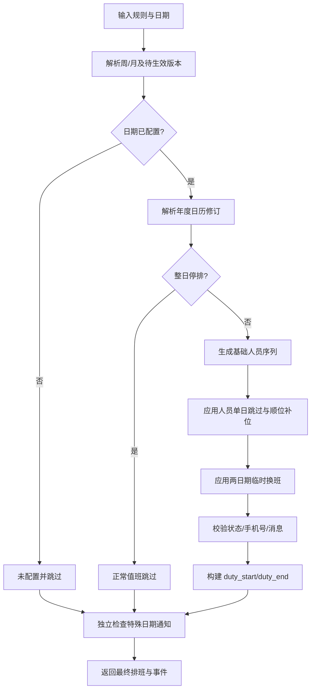

# 节假日跳过与排班例外技术方案

## 文档状态

- 日期：2026-08-21。
- 状态：`LOCAL_SYSTEM_INTEGRATION_COMPLETE`。
- 对应需求：`docs/@demand/duty_holiday_calendar_and_schedule_exceptions_20260821.md`。
- 本轮产物：系统审计、架构方案、数据/API 设计、任务拆解、测试计划及本地实现。
- 本轮边界：允许本地代码和本地数据库改动；不提交、不推送、不发包、不发布生产。
- 业务决策：对应需求文档第 15 节八项推荐方案已于 2026-08-21 全部确认。

## 1. 现有系统审计

### 1.1 前端

主要文件：`frontend/src/views/SettingsPage.vue`。

| 现有能力 | 现有位置/函数 | 结论 |
| --- | --- | --- |
| 设置页标题 | `.dt-page-header`，标题“设置” | 可在标题行最右侧增加入口；建议使用现有 `flex-between` 布局 |
| 规则加载 | `loadSettings` | 当前只拉取自动任务规则、日志和消息 |
| 人员加载 | `ensureStaffList` | 当前通过 `/staff` 拉取并使用 `isActiveLike` 排除离职 |
| 周/月值班配置 | `normalizeDutyConfig`、详情/批量弹窗 | 现有配置全部保存在规则 `duty_config` |
| 轮换解析 | `rotationSequenceIndex`、`rotationStaffIdForDate` | 当前按星期范围累计，不识别节假日和例外 |
| 概览和后续预览 | `getResolvedDutyItem`、未来三周方法 | 前端复制了一套排班计算逻辑，新增复杂规则后容易与后端分叉 |
| 特殊通知 | 无 | 需要新增独立编辑和状态展示 |

### 1.2 后端

主要文件：`backend/src/services/AutoTaskService.js`、`backend/src/routes/settings.js`。

| 现有能力 | 现有位置/函数 | 结论 |
| --- | --- | --- |
| 值班配置规范化 | `normalizeDutyConfig` | 兼容旧 JSON，并维护周模式版本 |
| 待生效版本 | `resolveWeeklyDutyProfile` | 按 `effective_date` 解析，可借鉴其版本化方式 |
| 周轮换索引 | `rotationSequenceIndex` | 使用“完整周 × end_weekday + 本周星期”计算，需要改成有效排班日计数 |
| 真实日期人员 | `getDutyItemForParts` | 后端唯一真实调度入口，未来应委托统一排班解析服务 |
| 事件生成 | `buildDutyEventsForParts`、`getDueDutyEvents` | 目前只有 `duty_start`、`duty_end` |
| 下次执行时间 | `getNextRunAt` | 最多向后扫描 400 天，可复用但需接入有效日期解析 |
| 发送 | `executeDutyEvent`、`sendDutyWebhook` | 已有幂等日志和独立失败隔离，可复用消息发送底层 |
| 设置 API | `/api/settings/auto-tasks` | 不适合继续塞入全局全年日历大对象，建议新增专用路由 |

### 1.3 数据

- `auto_task_rules.duty_config` 是单规则 JSON，适合周/月模板和待生效版本，不适合全局年度日历、多人协作修订和跨日期换班。
- `auto_task_run_logs` 唯一键是 `(rule_id, scheduled_at, event_type)`。
- 若同一日期未来允许多条特殊通知，现有 `event_type VARCHAR(30)` 不足以安全承载通知 UUID，建议使用独立通知日志表。
- 团队人员状态包含 `active`、`resigned`、`retained`、`long_leave`；当前值班 UI 仅排除 `resigned`。

## 2. 架构原则

1. **单一排班解析源**：后端统一生成基础/最终排班；前端只消费预览 API，不再复制新增算法。
2. **全局日历与规则例外分离**：周末/法定/手动停排是全局年度配置；人员跳过、换班和通知目标绑定具体自动值班规则。
3. **版本化生效**：年度日历通过 `effective_from` 修订生效，不允许编辑历史后静默重算已经执行的轮换游标。
4. **通知解耦**：特殊日期通知和正常值班事件分开计算、分开日志、分开幂等。
5. **后端强校验**：前端隐藏按钮不能代替服务端权限、日期、人员、冲突和状态校验。
6. **向后兼容**：没有日历修订时完全走现有值班逻辑，旧 `duty_config` 不迁移、不重写。

## 3. 推荐模块边界

### 3.1 后端新增

```text
backend/src/models/
  DutyCalendarRevision.js
  DutyCalendarRuleException.js
  DutyScheduleSwap.js
  DutySpecialNotificationLog.js

backend/src/routes/
  dutyCalendar.js

backend/src/services/
  DutyCalendarService.js
  DutyScheduleResolver.js
  DutySpecialNotificationService.js

backend/src/data/china-holidays/
  2026.json
```

### 3.2 前端新增

```text
frontend/src/components/settings/
  DutyCalendarDialog.vue
  DutyCalendarYearGrid.vue
  DutyCalendarDatePanel.vue
  DutyScheduleSwapEditor.vue

frontend/src/api/
  dutyCalendar.js
```

`SettingsPage.vue` 只负责标题按钮、弹窗开关、当前权限和刷新自动任务规则，避免继续扩大单文件复杂度。

## 4. 数据模型

最终字段须在第 15 节需求确认后再冻结。以下为推荐结构。

### 4.1 `duty_calendar_revisions`

保存全局年度停排日修订。

| 字段 | 类型 | 说明 |
| --- | --- | --- |
| `id` | `CHAR(36)` | 主键 |
| `calendar_year` | `SMALLINT` | 年份 |
| `revision_no` | `INT` | 年内递增版本 |
| `effective_from` | `DATE` | 该版本开始影响排班的日期 |
| `weekend_policy` | `VARCHAR(30)` | `all_weekends` 或待确认的 `official_workday_override` |
| `official_days` | `LONGTEXT` JSON | 官方节日日期、名称、区间和属性 |
| `manual_overrides` | `LONGTEXT` JSON | `date -> force_skip/force_work` |
| `source_title` | `VARCHAR(255)` | 官方来源标题 |
| `source_url` | `TEXT` | 官方来源 URL |
| `source_version` | `VARCHAR(100)` | 数据版本/校验摘要 |
| `created_by` | `VARCHAR(100)` | 操作人标识 |
| `created_at` | `DATETIME` | 创建时间 |

索引：

- 唯一 `(calendar_year, revision_no)`。
- 普通 `(calendar_year, effective_from)`。

每次保存新增修订，不覆盖旧版本。对于日期 D，选择 `effective_from <= D` 的最新修订。

### 4.2 `duty_calendar_rule_exceptions`

保存具体规则、具体日期的人员例外和一条特殊通知配置。

| 字段 | 类型 | 说明 |
| --- | --- | --- |
| `id` | `CHAR(36)` | 主键 |
| `rule_id` | `CHAR(36)` | 自动值班规则 ID |
| `calendar_date` | `DATE` | 日期 |
| `skip_staff_ids` | `LONGTEXT` JSON | 当日跳过人员 |
| `notice_enabled` | `BOOLEAN` | 是否发送特殊通知 |
| `notice_time` | `CHAR(8)` | 北京时间时分秒 |
| `notice_message` | `TEXT` | 通知正文 |
| `notice_at_mode` | `VARCHAR(20)` | `none/people/all` |
| `notice_staff_ids` | `LONGTEXT` JSON | 指定 @ 人 |
| `notice_webhook_ids` | `LONGTEXT` JSON | 待确认后决定是否允许细选 |
| `revision` | `INT` | 乐观锁 |
| `created_at/updated_at` | `DATETIME` | 审计时间 |

唯一 `(rule_id, calendar_date)`。

### 4.3 `duty_schedule_swaps`

保存两日期之间的一对一换班。

| 字段 | 类型 | 说明 |
| --- | --- | --- |
| `id` | `CHAR(36)` | 主键 |
| `rule_id` | `CHAR(36)` | 同一自动值班规则 |
| `date_a/date_b` | `DATE` | 两个目标日期，保存时标准化为 A < B |
| `staff_a_id/staff_b_id` | `CHAR(36)` | 被交换人员 |
| `status` | `VARCHAR(20)` | `active/cancelled/invalid` |
| `revision` | `INT` | 乐观锁 |
| `created_at/updated_at` | `DATETIME` | 审计时间 |

约束与校验：

- A、B 不得相同。
- 两日期必须属于同一规则且尚未成功执行。
- 同一规则、日期、人员只能参与一个有效换班。

### 4.4 `duty_special_notification_logs`

独立记录特殊通知执行，避免占用正常 `duty_start/duty_end` 唯一键。

| 字段 | 类型 | 说明 |
| --- | --- | --- |
| `id` | `CHAR(36)` | 主键 |
| `exception_id` | `CHAR(36)` | 对应日期配置 |
| `rule_id` | `CHAR(36)` | webhook 所属规则 |
| `scheduled_at` | `DATETIME` | 计划时间 |
| `status` | `VARCHAR(20)` | `running/success/failed` |
| `notify_error` | `TEXT` | 脱敏错误 |
| `created_at/updated_at` | `DATETIME` | 执行时间 |

唯一 `(exception_id, scheduled_at)`，调度器重复扫描不得重复发送。

## 5. 官方节假日数据文件

推荐使用版本控制内的年度 JSON 快照，不在调度期间访问外网：

```json
{
  "year": 2026,
  "source_title": "国务院办公厅关于2026年部分节假日安排的通知",
  "source_url": "待开发前核对官方原文",
  "verified_at": "待填写",
  "days": [
    {
      "date": "YYYY-MM-DD",
      "holiday_name": "节日名称",
      "range_id": "holiday-range-id",
      "is_holiday": true,
      "is_adjusted_workday": false
    }
  ]
}
```

开发准入要求：

1. 来源必须是国务院或中国政府网官方页面。
2. 两人交叉核对日期、节日区间和调休上班日。
3. 在需求/开发归档记录 URL、抓取日期和文件 SHA-256。
4. JSON 只作为初始化源；管理员覆盖值仍保存在数据库修订中。

## 6. API 设计

统一前缀：`/api/settings/duty-calendar`。

### 6.1 查询全年配置

`GET /api/settings/duty-calendar?year=2026&rule_id=<id>`

返回：

- 年份和当前修订号。
- 官方来源元数据。
- 365/366 个日期的派生状态：周末、法定、手动覆盖、有效停排、未配置。
- 选中规则的日期例外和换班摘要。
- 当前规则未来排班冲突数。

不返回原始 webhook token，只返回稳定的 webhook 配置 ID 和脱敏名称。

### 6.2 预览排班

`POST /api/settings/duty-calendar/preview`

请求：

```json
{
  "rule_id": "rule-id",
  "from": "2026-08-21",
  "to": "2026-10-31",
  "draft": {
    "calendar_revision": {},
    "exceptions": [],
    "swaps": []
  }
}
```

返回每一天：

- 日期、是否配置、停排原因。
- 基础人员、人员跳过、补位人员、换班后最终人员。
- 开始/结束事件时间。
- 特殊通知状态。
- 冲突和告警。

保存前必须调用预览并阻止未解决的错误级冲突。

### 6.3 原子保存

`PUT /api/settings/duty-calendar/:year`

请求必须包含：

- 客户端当前 `revision_no`。
- `effective_from`。
- 官方数据版本确认值。
- 手动覆盖列表。
- 选中规则日期例外。
- 新增、编辑、取消的换班记录。

后端事务步骤：

1. 权限校验。
2. 修订号校验。
3. 日期、年份和数据类型校验。
4. 重新执行服务端排班预览。
5. 校验人员状态、手机号、换班关系和已执行日志。
6. 创建年度修订并 upsert 日期例外/换班。
7. 写审计摘要。
8. 提交后返回服务端最终结果。

### 6.4 换班取消

`DELETE /api/settings/duty-calendar/swaps/:id`

- 只做逻辑取消，保留审计记录。
- 已成功执行的换班不可取消历史结果。

### 6.5 特殊通知测试

需求未明确要求，本期默认不提供；若用户确认需要，可新增：

`POST /api/settings/duty-calendar/notices/:exceptionId/test`

测试发送必须使用独立测试标识，不写正式日志、不占正式幂等键。

## 7. 统一排班解析器

### 7.1 输出结构

`DutyScheduleResolver.resolveDate(rule, date, context)` 返回：

```json
{
  "date": "2026-08-24",
  "configured": true,
  "whole_day_skipped": false,
  "skip_reasons": [],
  "base_staff_ids": ["staff-a"],
  "skipped_staff_ids": [],
  "replacement_staff_ids": [],
  "swapped_staff_ids": [],
  "final_staff_ids": ["staff-a"],
  "duty_item": {},
  "events": [],
  "warnings": []
}
```

### 7.2 核心流程



### 7.3 轮换游标

现有公式按星期槽位计数，需要替换为按有效排班日计数：

```text
rotation_index(date)
  = anchor_index
  + countEligibleDutySlots(anchor_date, date)
  + countConsumedReplacementSlots(anchor_date, date)
```

- 整日停排和未配置日期不增加 `countEligibleDutySlots`。
- 人员跳过是否增加额外消耗由需求第 15.2 项确认。
- 为避免每秒从锚点扫描多年日期，可按规则/日历修订缓存前缀计数，缓存键包含规则更新时间和日历修订号。

### 7.4 固定/月度顺延

若确认连锁顺延：

1. 从版本生效锚点开始按日期生成基础“排班单元”队列。
2. 仅把排班单元映射到有效配置日。
3. 整日停排删除日期槽位，不删除队首排班单元。
4. 人员跳过可消耗当前单元并拉取后续单元补位。
5. 版本边界处停止并生成未处理队列告警，不能自动穿透。

若用户确认固定模式只跳过不顺延，则保留现有按星期/月日直接映射，只有轮换模式启用有效日游标。

## 8. 特殊通知调度

### 8.1 扫描

- 调度器继续按北京时间运行。
- 每次扫描未来/当前一分钟内启用的特殊通知。
- 到时后使用 `findOrCreate` 或条件更新抢占 `running` 状态。
- 成功、失败和过期状态独立于正常值班日志。

### 8.2 webhook 与 @

- 从目标自动值班规则读取 webhook 配置，不复制 token 到新表。
- webhook 细选只保存稳定配置 ID；发送前再次解析当前启用状态。
- `at_mode=people` 时服务端重新查询人员；离职、手机号为空或不合法人员从 @ 列表移除，并写告警。
- 文案转义和卡片格式复用 `sendDingTalkCard`，标题建议另设为 `节假日通知：` 或由用户确认。

### 8.3 幂等

- 正式唯一键 `(exception_id, scheduled_at)`。
- 测试发送使用独立流程。
- 规则保存、页面刷新、PM2 重启和多实例同时扫描均不得重复发送。

## 9. 前端交互实现建议

### 9.1 设置页最小接入

`SettingsPage.vue` 仅增加：

- `CalendarDays` 图标导入。
- 弹窗可见状态。
- 标题行右侧按钮。
- `DutyCalendarDialog` 组件。

标题结构建议：

```text
[设置 + 页面说明]                                      [日历图标 节假日跳过设置]
```

### 9.2 日历组件

- 12 个月使用 CSS Grid，日期格使用固定 `aspect-ratio` 或统一最小高度。
- 颜色通过 CSS 变量定义，并同时渲染文字标签。
- 焦点日期与停排类型使用不同视觉通道：焦点用边框，类型用底色。
- 键盘支持：Tab 进入月份，方向键移动日期，Space/Enter 切换状态。
- 日期单击只修改草稿，不立即请求后端。

### 9.3 下方详情区

使用页签而非按钮卡片：

1. `日期规则`：来源、整日停排状态、强制覆盖。
2. `特殊通知`：开关、时间、文案、@ 人和目标。
3. `人员跳过`：在职候选人多选和补位预览。
4. `临时换班`：目标日期/人员、双向预览和冲突。

页面底部固定操作区：`取消`、影响摘要、`保存生效`。

### 9.4 影响预览

保存前显示：

- 未来 3 个自然周或当前月的基础人员与最终人员。
- 被整日跳过、顺延、人员补位、换班的日期数量。
- 无人可补位、跨版本未处理和失效人员等冲突。

## 10. 权限、安全与隐私

- GET 允许管理员查看；PUT/DELETE 复用设置编辑权限。
- 后端不信任前端颜色、日期分类或人员状态，全部重新计算。
- webhook URL/token 不进入日历 API、日志、Tooltip 或浏览器存储。
- 通知正文按现有 Markdown 安全规则限制长度和危险内容。
- 人员 ID、日期、时间和 JSON 数组必须做白名单校验。
- 保存事务限制单次最大年份、日期和批量记录数量，防止超大请求 DoS。
- 审计日志不得记录手机号全量和 webhook 地址。

## 11. 性能与缓存

- 全年 366 天加少量规则例外，单次 API 目标 P95 < 300ms。
- 年度日历按 `(year, revision_no)` 缓存。
- 排班预览按 `(rule_id, rule.updated_at, calendar_revision, from, to)` 缓存。
- 日历或规则保存后精准失效对应缓存。
- 调度器单次只计算今天事件和最近必要窗口，不每秒生成全年排班。

## 12. 迁移与兼容

1. 新表使用幂等建表，不修改或重建现有业务表。
2. 没有年度修订时，`DutyScheduleResolver` 直接委托现有 `getDutyItemForParts` 行为。
3. 现有 `duty_config`、周版本、子通知和历史日志不变。
4. 新功能可通过全局开关关闭；关闭后调度恢复旧逻辑，但不删除配置。
5. 本地迁移前先备份本地数据库；生产发布另需用户再次授权。

## 13. 开发任务拆解

### 阶段 A：确认与数据基础

1. 关闭需求第 15 节全部待确认项。
2. 核对官方年度节假日文件并归档来源。
3. 新增 4 个模型和幂等迁移。
4. 实现年度日历规范化、修订查询和权限校验。

### 阶段 B：统一排班解析

1. 提取 `DutyScheduleResolver`。
2. 接入周轮换有效日期计数。
3. 按确认结果实现固定/月度顺延。
4. 实现人员跳过和无人可补位告警。
5. 实现换班最终覆盖。
6. 让 `getDutyItemForParts`、`getNextRunAt`、预览和测试发送统一调用解析器。

### 阶段 C：特殊通知

1. 日期通知 CRUD 与事务保存。
2. @ 人解析、目标 webhook 解析。
3. 独立调度、日志和幂等。
4. 失败隔离和状态展示。

### 阶段 D：前端

1. 设置页标题按钮和权限。
2. 全年日历、颜色图例、年份和规则选择。
3. 日期单击草稿与详情页签。
4. 人员多选、换班编辑和冲突提示。
5. 特殊通知编辑与 @ 人弹窗。
6. 影响预览和原子保存。

### 阶段 E：质量门禁

1. 单元/属性测试。
2. API 与事务测试。
3. 调度器隔离 webhook 测试。
4. 浏览器桌面/移动布局和键盘测试。
5. 全量既有子通知/值班回归。
6. 数据守恒与敏感信息扫描。

## 14. 测试矩阵

### 14.1 日期

- 平年、闰年、2 月 29 日。
- 月末 28/29/30/31 日。
- 周末与法定节假日重叠。
- 取消默认周末、取消法定节假日、恢复默认。
- 连续 1、3、7 天停排。
- 跨周、跨月、跨年和版本生效日。

### 14.2 模式

- 周固定单人/多人。
- 周轮换 1 人、2 人、人员少于/多于有效日。
- 月度稀疏配置和连续配置。
- 未配置日期不消耗轮换游标。

### 14.3 人员

- 单人跳过、多人员跳过、所有人跳过。
- 跳过人员同时留职、长假、离职或手机号为空。
- 单人固定、多人员固定、轮换补位。
- 有效换班、同日换班、跨规则换班、已执行日期换班、换班后人员离职。

### 14.4 通知

- 停排日正常值班不发送，特殊通知发送。
- 特殊通知关闭、启用、失败、重启后幂等。
- 不 @、@ 指定、@ 所有人。
- 批量区间生成后单日关闭。
- 多规则同一时刻互不阻断。

### 14.5 回归

- 固定/轮换模式切换与待生效版本。
- 后续三周预览。
- 只发送开始提醒、开始和结束都发送。
- 子通知激活、6 天兜底和倒计时。
- 离职人员过滤、角色配置、普通自动任务。

## 15. 风险与控制

| 风险 | 影响 | 控制 |
| --- | --- | --- |
| 过去节假日参与重算 | 当前轮换人员突然变化 | 年度修订 `effective_from`，过去日期不回算 |
| 固定模式顺延语义不明确 | 星期与人员映射永久漂移 | 用户确认后实现，保存前展示影响预览 |
| 前后端算法分叉 | 页面人员与真实通知不同 | 新逻辑只在后端解析，前端消费预览 API |
| 同日全局停排与人员跳过冲突 | 产生无意义配置 | 整日停排优先，人员页签禁用并说明 |
| 换班后人员离职 | 发送对象无效 | 保存和调度双重校验，失效时告警并回退 |
| 多实例重复特殊通知 | 群内重复消息 | 独立日志唯一键和条件抢占 |
| 官方日期录入错误 | 大范围排班错误 | 官方来源、双人核对、版本和影响预览 |
| 多管理员覆盖 | 配置丢失 | 修订号乐观锁和事务保存 |

## 16. 回滚设计

- 本地开发期可关闭功能开关，旧排班逻辑不受影响。
- 年度修订不物理删除；可以创建新修订恢复上一版本覆盖。
- 人员例外和换班使用逻辑取消。
- 已成功发送的历史日志不回滚。
- 数据表只新增，不删除旧字段；回滚应用版本时旧版本忽略新表。

## 17. 当前结论

- 需求具备可实现性，固定/月度连锁顺延等八项业务语义已经确认，本地实施与验证已完成。
- 推荐采用“全局年度修订 + 规则日期例外 + 换班 + 独立通知日志”的结构，不继续扩展单条规则 `duty_config` 大 JSON。
- 推荐让后端成为唯一排班计算源，前端只展示服务端预览。
- 本文是本地实施基线；完成情况与验证证据见同日实施记录和测试归档，不得作为已发布证明。

## 18. 2026-08-23 增量实施计划

### 18.1 数据与服务

1. 新增 `duty_holiday_snapshots` 表，按年份唯一保存已验证快照和同步状态。
2. 新增官方快照同步服务：政策文件库发现、官方 URL 白名单、HTML 正文规范化、中文日期区间解析、七类节日完整性校验、校验和、持久化和重试。
3. 启动时载入持久化快照并导入仓库内已复核静态快照；后台只同步当前年和下一年，其他年份在查询时按需同步。
4. `DutyCalendarService` 保持同步快照读取接口，异步同步完成后原子更新内存缓存并使排班解析缓存失效。

### 18.2 排班解析

1. 调整 `deriveCalendarDay`：`is_adjusted_workday` 覆盖普通周末默认停排。
2. 调整顺延模拟：补班日即使没有对应周末模板，也作为有效目的日期，消费顺延队列的下一排班单元。
3. 日历修订继续保存人工覆盖；官方日期使用最新已验证年度快照，避免未来通知发布后旧空快照永久阻断自动生效。
4. 自动值班、普通自动任务、子通知和下一次执行时间继续通过同一全局日期解析器生效。

### 18.3 前端

1. 年份选择扩展为 2007 至 2100，并显示同步状态、来源和最后校验时间。
2. 打开弹窗即请求整年预览，按日期映射最终人员；任何影响排班的草稿修改后刷新整年预览。
3. 日期格增加最终人员、农历、状态层级；增大字号和格子稳定高度。
4. 增加 `contextmenu.prevent` 右键只选中日期行为。
5. 增加今天九色旋转边框和 `prefers-reduced-motion` 降级。

### 18.4 测试与门禁

1. 解析器单元测试覆盖同月区间、跨月区间、合并节日、多个补班日、非法和冲突日期。
2. 通过依赖注入的本地官方响应夹具验证历史同步、未来待发布、发布后重试和旧快照保留，测试期间不得向生产或真实 webhook 写数据。
3. API 集成验证补班正常排班、全年人员、自动任务与子通知日期解析一致。
4. 浏览器验证左键切换、右键只选、农历、姓名、补班、九色当天环、桌面/移动布局和控制台错误。
5. 执行既有 16 项节假日全链路回归、构建、敏感信息扫描和数据库基线守恒检查。
6. 增加 `start_only` 残留结束文案回归：前端所有预览和后端事件均只能出现一条开始通知。

### 18.5 周末预览缺口修正

1. 运行时预览 API 窗口由“今天至未来 399 天”调整为“过去 14 天至未来 385 天”，保持单次请求不超过 400 天。
2. 新增最近实际值班日查找；仅当今天无有效值班且最近值班日为 `start_only` 时锚定该日。
3. 顶部摘要和最近通知列表复用同一选择函数；后端真实事件生成逻辑不变。
4. 在当前周日数据上验证：周五只显示开始、结束记录为 0；周一 `start_and_end` 的后端事件能力继续保留。

### 18.6 发送策略一致性加固

1. 将单日编辑弹窗的发送预览改为独立条目：`start_only` 渲染 1 条，`start_and_end` 渲染 2 条，并展示实际发送数量。
2. 对未排班日期保留模板预览，同时明确标注实际为 0 条，避免把模板展示误解为已进入调度。
3. 单日和批量保存都校验开始文案；`start_and_end` 额外校验结束文案。
4. 后端 `normalizeRulePayload` 遍历周、月和周版本配置，按固定/轮换实际排班语义拒绝缺少结束文案的双通知配置。
5. 自动化同时断言：仅开始为 `start/[]`，双通知为 `start/end`；接口负向请求返回 HTTP 400 且不创建规则。
