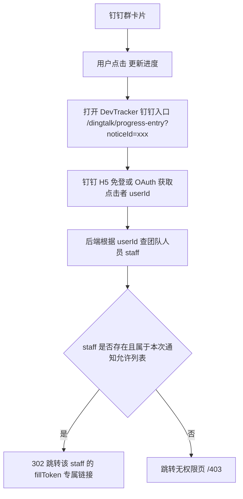

# 钉钉群卡片“更新进度”个性化跳转能力调研文档

**文档类型**：调研方案，不进入编码  
**编写日期**：2026-05-18  
**需求来源**：钉钉群通知卡片需展示为截图样式，并实现点击“更新进度”后跳转到点击者自己的团队人员专属链接；未被 @ 到的人点击时进入无权限页。  
**当前结论**：可以实现，但不能仅靠当前“群自定义机器人 webhook”安全实现；需要接入钉钉用户身份识别能力。

**2026-05-18 最终决策**：本阶段不做点击跳转、不做点击者身份识别、不接入钉钉企业应用；仅使用当前群自定义机器人 webhook 发送卡片式通知。

---

## 1. 需求拆解

目标效果包含三层：

1. **消息展示层**  
   钉钉群中展示类似截图的卡片：浅色标题区、正文版本/负责人/计划说明、@ 人列表、底部“更新进度”按钮。

2. **身份识别层**  
   用户点击“更新进度”时，系统必须知道点击者是谁。

3. **权限路由层**  
   - 点击者是本次通知 @ 到的人员：跳转到该点击者在团队人员页面的专属填写链接。
   - 点击者不是本次通知 @ 到的人员：跳转无权限页。
   - 不能跳到别人链接，不能通过 URL 猜测或复制获得他人入口。

---

## 2. 官方能力调研

### 2.1 群自定义机器人 webhook

当前系统使用的是钉钉群自定义机器人 webhook。

它能做到：

- 发送文本、Markdown、Link、ActionCard、FeedCard 等消息。
- 使用 `atMobiles` 或 `isAtAll` 实现 @ 人或 @ 所有人。
- ActionCard 可以带按钮，按钮点击后打开一个固定 URL。

它做不到：

- webhook 本身不会在按钮点击时回调业务系统。
- webhook ActionCard 的按钮 URL 是同一个 URL，群里任何人点击都一样。
- webhook 无法告诉系统“具体是哪一个钉钉用户点击了按钮”。

因此，**仅靠当前 webhook 不能安全满足“谁点就进谁自己的专属链接”**。如果把按钮直接配置为某个 staff 的 fillToken，会导致所有人都进入同一个人的链接；如果配置一个公共链接，又无法区分点击者。

### 2.2 钉钉互动卡片

钉钉官方互动卡片用于“即时交互、多人协同、数据驱动”的轻量卡片，支持普通版和高级版。官方资料中提到互动卡片可以发送、更新，并支持卡片回调、HTTP 或 Stream 模式回调。

互动卡片能做到：

- 更接近截图中的卡片式 UI。
- 按钮可以配置“链接跳转”或“回传请求”。
- 回传请求会把 `corpId`、`userId`、按钮 actionId 和参数传给业务服务端。

官方资料依据：

- 钉钉互动卡片概述：`https://opensource.dingtalk.com/developerpedia/docs/learn/card/intro/`
- 交互方式说明：`https://dingtalk.apifox.cn/doc-3596118`
- 事件回调说明：`https://dingtalk.apifox.cn/doc-3595405`

关键点：

- 互动卡片“回传请求”可以拿到点击者 `userId`。
- 互动卡片的“链接跳转”本身仍然是链接，需要配合身份识别或变量能力。
- 若要完全卡片内闭环处理，需要开发钉钉企业内部应用/机器人能力，不再是单纯 webhook。

### 2.3 钉钉 H5 免登 / OAuth

另一个可行路径是：按钮仍然跳到一个系统中间页，但这个中间页必须在钉钉内完成身份识别。

流程：

1. 用户点击钉钉卡片按钮。
2. 打开 DevTracker 的中间页，例如 `/dingtalk/progress-entry?noticeId=xxx`。
3. 中间页通过钉钉 H5 免登或 OAuth 获取当前钉钉用户身份。
4. 后端拿到钉钉 `userId` 或手机号。
5. 后端把钉钉用户映射到 DevTracker 的 `staff`。
6. 后端检查该 staff 是否属于本次通知的 @ 人列表。
7. 通过则 302 跳转到该 staff 的 `fillToken` 专属链接。
8. 不通过则跳转 `/403` 或无权限页。

这条路线可以满足“谁点就进谁自己的专属链接”。

注意：

- 需要钉钉企业内部应用或网站应用配置。
- 需要 AppKey/AppSecret/CorpId/回调域名等钉钉开放平台配置。
- 最好在团队人员表中保存 `dingtalk_user_id`，手机号仅作为辅助映射，不建议作为唯一身份凭证。

---

## 3. 可行性结论

| 方案 | 展示接近截图 | 能识别点击者 | 能安全跳自己链接 | 非 @ 人无权限 | 实现成本 | 结论 |
| --- | --- | --- | --- | --- | --- | --- |
| A. 继续使用当前 webhook + ActionCard 固定 URL | 中等 | 否 | 否 | 否 | 低 | 不满足核心安全需求 |
| B. webhook 卡片 + 钉钉免登中间页 | 中等 | 是 | 是 | 是 | 中 | 推荐的低改造方案 |
| C. 钉钉互动卡片 + 免登中间页 | 高 | 是 | 是 | 是 | 中高 | 推荐的完整体验方案 |
| D. 钉钉互动卡片 + 回调处理 + 跳转/更新 | 高 | 是 | 取决于回调能力 | 是 | 高 | 可作为二期增强 |

推荐结论：

**先采用方案 B 或 C。**  
如果只要求功能安全优先，用 B；如果要求卡片样式尽量贴近截图，用 C。

---

## 4. 推荐实现方案

### 4.1 推荐方案：互动卡片或 ActionCard + 身份网关

不要把“更新进度”按钮直接放真实 fillToken。  
按钮统一跳转到身份网关：

```text
https://jfzhu8023.cloud/devtracker/dingtalk/progress-entry?noticeId=NOTICE_ID
```

`NOTICE_ID` 是本次通知记录 ID，不包含任何人员 token。

### 4.2 点击流程



### 4.3 权限判断口径

#### 仅 @ 人模式

允许访问的人 = 本次通知实际 @ 到的人员。

判断依据：

- 通知发送时保存 `notice_id`。
- 保存本次通知的 `allowed_staff_ids`。
- 点击时根据钉钉 userId 找到 staff。
- staff.id 在 `allowed_staff_ids` 内则允许。

#### @ 所有人模式

建议口径：

- 允许访问的人 = DevTracker 团队人员中已绑定钉钉身份的在职人员。
- 非团队人员即使在钉钉群里，也进入无权限页。

原因：

- @ 所有人会覆盖整个群，但 DevTracker 专属链接只对团队人员有意义。
- 不能让群内非系统人员进入任意填报入口。

---

## 5. 数据设计建议

### 5.1 staff 表扩展

当前已有：

- `id`
- `name`
- `role`
- `phone`
- `fillToken`

建议新增：

- `dingtalk_user_id`：钉钉企业内用户 ID，强匹配字段。
- `dingtalk_union_id`：可选，用于跨应用识别。
- `dingtalk_bound_at`：绑定时间，可选。

手机号继续保留，用于 @ 和人工核对，但不建议只靠手机号做点击身份认证。

### 5.2 通知记录表

新增 `dingtalk_progress_notices`：

| 字段 | 说明 |
| --- | --- |
| id | 通知 ID |
| rule_id | 自动任务规则 ID |
| task_id | 本次生成的任务 ID |
| title | 卡片标题 |
| content | 卡片正文 |
| at_mode | people/all |
| allowed_staff_ids | JSON，允许点击进入的人员 |
| card_msg_id/out_track_id | 钉钉卡片消息追踪 ID，可选 |
| created_at | 创建时间 |

### 5.3 点击审计表

新增 `dingtalk_progress_click_logs`：

| 字段 | 说明 |
| --- | --- |
| id | 日志 ID |
| notice_id | 通知 ID |
| dingtalk_user_id | 点击者钉钉 userId |
| staff_id | 匹配到的 staff |
| result | allowed/forbidden/unbound/error |
| target_url | 实际跳转地址，不建议完整记录 token，可记录脱敏 |
| created_at | 点击时间 |

---

## 6. 卡片展示方案

### 6.1 使用自定义机器人 ActionCard（早期方案，已废弃）

早期评估中，该方式可做出带按钮的基本卡片：

- 标题：`今天计划完成版本`
- Markdown 正文：版本、负责人、计划说明、@ 名单
- 按钮：`更新进度`
- 按钮 URL：身份网关链接

当前最终执行口径已调整为：使用自定义机器人 `markdown` 消息，标题为 `语音产研进度维护通知：`，不显示底部“更新进度”按钮。

优点：

- 改造成本较低。
- 可复用当前 webhook 机器人。

缺点：

- 样式未必能与截图完全一致。
- 点击者识别仍依赖身份网关，不是 webhook 自身能力。
- 是否能在 ActionCard 内稳定展示 @ 人效果需要实际钉钉群验证。

### 6.2 使用钉钉互动卡片

更推荐用于还原截图：

- 用卡片搭建器设计标题区域、正文、@ 人列表和底部按钮。
- 按钮可配置链接跳转到身份网关。
- 后续可扩展按钮回调、卡片更新、点击 Toast 等能力。

优点：

- UI 更贴近截图。
- 官方支持回调，后续可拿点击者 userId 做更强交互。

缺点：

- 需要钉钉开放平台应用配置。
- 需要 AppKey/AppSecret/回调配置/卡片模板发布。
- 开发量明显高于当前 webhook。

---

## 7. 接口设计建议

### 7.1 发送卡片

自动任务生成成功后：

```text
POST /api/settings/auto-tasks/:id/send-progress-card
```

或复用自动任务发送逻辑，新增卡片模板配置。

后端处理：

1. 生成 `notice_id`。
2. 保存允许点击的 `allowed_staff_ids`。
3. 生成身份网关 URL。
4. 发送钉钉卡片。

### 7.2 钉钉入口页面

```text
GET /dingtalk/progress-entry?noticeId=xxx
```

页面职责：

- 判断是否在钉钉客户端环境。
- 获取免登授权码。
- 调用后端换取点击者身份。
- 根据后端返回跳转。

### 7.3 身份校验接口

```text
POST /api/dingtalk/progress-auth
```

请求：

```json
{
  "notice_id": "xxx",
  "auth_code": "钉钉免登码"
}
```

响应：

```json
{
  "code": 0,
  "data": {
    "allowed": true,
    "redirect_url": "/fill/xxx"
  }
}
```

不允许：

```json
{
  "code": 403,
  "message": "无权限访问该进度入口"
}
```

---

## 8. 安全边界

必须遵守：

1. 卡片按钮 URL 不携带 staff fillToken。
2. 卡片按钮 URL 只携带 noticeId。
3. noticeId 只能表示“一次通知”，不能表示某个人。
4. 后端必须通过钉钉身份确认点击者。
5. 点击者必须映射到唯一 staff。
6. 点击者必须在本次通知允许列表内。
7. 失败时统一进入无权限页，不暴露其他人链接。
8. 所有点击行为写审计日志。

风险点：

- 如果只靠手机号映射，用户手机号变更或隐藏时会失败。
- 如果团队人员未绑定钉钉 userId，首次点击可能无法识别。
- 如果系统部署域名没有配置到钉钉应用可信域名，免登会失败。
- 如果用户从外部浏览器打开，无法获取钉钉免登身份，应拒绝或引导在钉钉内打开。

---

## 9. 实施前置条件

需要用户或管理员提供：

1. 钉钉开放平台企业内部应用或网站应用配置权限。
2. `CorpId`。
3. `AppKey`。
4. `AppSecret`。
5. 可配置的线上回调/可信域名，例如 `jfzhu8023.cloud`。
6. 是否允许读取通讯录用户信息，用于建立 `dingtalk_user_id -> staff` 映射。
7. 是否采用互动卡片模板，如果采用，需要在钉钉卡片搭建器创建并发布模板。

---

## 10. 分阶段落地建议

### 阶段一：低风险验证

目标：验证“点击者身份识别 + 跳自己链接”是否跑通。

范围：

- 创建钉钉应用。
- 新增 DevTracker 钉钉入口页。
- 新增 `staff.dingtalk_user_id`。
- 手动绑定 1-2 个测试人员。
- 卡片按钮跳身份网关。
- 验证点击者 A 只能进 A 的链接，B 只能进 B 的链接，未绑定用户进 403。

### 阶段二：接入当前自动任务通知

目标：替换当前纯文本 webhook 通知。

范围：

- 自动任务生成成功后创建 notice。
- 保存 allowed_staff_ids。
- 发送带“更新进度”按钮的卡片。
- 仅 @ 人 / @ 所有人 两种模式都按权限规则生成允许列表。

### 阶段三：优化卡片样式

目标：尽量还原截图。

范围：

- 使用互动卡片模板。
- 标题、版本内容、负责人、计划说明、@ 列表、底部按钮按截图布局。
- 如需要，支持按任务内容动态生成卡片正文。

### 阶段四：审计与异常处理

目标：可追踪、可排错。

范围：

- 点击日志。
- 未绑定用户提示。
- 非允许人员无权限。
- 钉钉身份接口失败提示。

---

## 11. 最终结论

可以实现，但必须明确：

1. **只用当前 webhook 不能安全实现**“谁点击就进谁自己的链接”。
2. **必须引入钉钉身份识别**，推荐 H5 免登/OAuth 身份网关。
3. 若要卡片样式高度贴近截图，推荐使用钉钉互动卡片；如果先验证功能，可以先用 ActionCard 近似实现。
4. 权限安全的核心不是 @ 文案，而是点击时后端根据钉钉 userId 校验点击者是否属于本次通知允许列表。
5. 建议先做阶段一 POC，再决定是否进入完整互动卡片开发。

## 11.1 本阶段采纳范围

用户已确认当前不做点击跳转，因此本阶段只采纳以下内容：

- 使用钉钉群自定义机器人 webhook。
- 使用 Markdown 卡片式通知展示。
- 保留标题、正文、@ 人列表，不显示底部“更新进度”按钮。
- 保留当前 `仅@人` 和 `@所有人` 两种 @ 策略。
- 不在通知中放任何人员专属跳转链接。
- 不实现点击者身份识别和权限跳转。

---

## 12. 参考资料

- 钉钉互动卡片概述：`https://opensource.dingtalk.com/developerpedia/docs/learn/card/intro/`
- 钉钉互动卡片交互方式：`https://dingtalk.apifox.cn/doc-3596118`
- 钉钉互动卡片事件回调：`https://dingtalk.apifox.cn/doc-3595405`
- 钉钉应用机器人接收消息说明：`https://opensource.dingtalk.com/developerpedia/docs/learn/bot/appbot/receive/`
- 钉钉自定义机器人发送群消息接口参考：`https://s.apifox.cn/apidoc/docs-site/467052/api-140275634`
