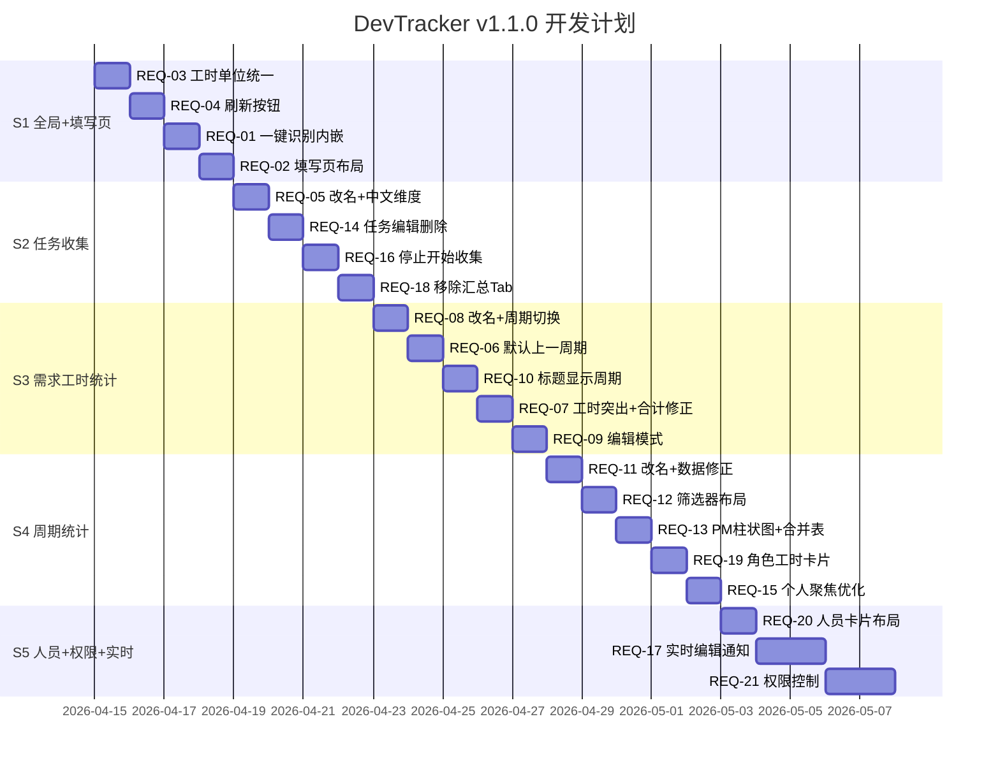

# DevTracker v1.1.0 — 开发计划

> **版本**：v1.1.0  
> **需求文档**：`docs/@demand/requirements_v1.1.0.md`  
> **预计里程碑**：5 个 Sprint  
> **创建时间**：2026-04-15 23:14

---

## 里程碑划分



---

## Sprint 1：全局变更 + 填写页优化

### S1-1: REQ-03 工时单位统一

| 文件 | 改动 |
|:---|:---|
| FillPage.vue L237 | `工时(h)` → `工时/小时` |
| FillPage.vue L256 | `h` → `小时` |
| FillPage.vue L90 | `${totalHours.value}h` → `${totalHours.value} 小时` |
| ReportPage.vue L132 | `h` → `小时` |
| ReportPage.vue L201 | `总计/h` → `总计/小时` |
| ReportPage.vue L186,191,196 | `(人/h)` → `(人/小时)` |
| TaskDetail.vue L249 | `工时(h)` → `工时/小时` |
| TaskDetail.vue L164 | `${p.hours}h` → `${p.hours}小时` |
| TaskDetail.vue L386 | `总计/h` → `总计/小时` |
| StatsPage.vue | 所有 `总工时/h` → `总工时/小时` |

### S1-2: REQ-04 全局刷新按钮

**实现方式**：在每个页面的 `dt-page-header` 区域右侧添加刷新按钮

```vue
<el-button circle :icon="RefreshIcon" @click="handleRefresh" title="刷新数据" />
```

| 页面 | 刷新函数 |
|:---|:---|
| TaskList.vue | `taskStore.fetchAll()` |
| TaskDetail.vue | `loadTaskData()` |
| ReportPage.vue | `reportStore.fetchByTask(selectedTaskId.value)` |
| StatsPage.vue（部门） | `loadDeptStats()` |
| StatsPage.vue（个人） | `statsStore.fetchPersonal(selectedStaffId.value, ...)` |
| PersonnelPage.vue | `staffStore.fetchAll()` |

### S1-3: REQ-01 一键识别内嵌

**改动**：
1. 删除 `<el-dialog>` 弹窗和 `showRecognize` 状态
2. 在表格上方添加：
```html
<div class="dt-recognize-area">
  <el-input v-model="recognizeText" type="textarea" :rows="4" placeholder="粘贴文本..." />
  <el-button type="primary" @click="parseRecognizeText">🔍 识别并填入</el-button>
</div>
```
3. 将 `+ 新增需求行` 按钮移到 `<el-table>` 下方靠左

### S1-4: REQ-02 填写页布局

**改动**：
```css
/* 旧 */ max-width: 960px; margin: 0 auto;
/* 新 */ padding: 0 150px;
```
- 需求标题列 `min-width: 200` → `min-width: 320`

---

## Sprint 2：任务收集模块

### S2-1: REQ-05 改名 + 维度中文化

| 位置 | 改动 |
|:---|:---|
| AppHeader.vue L15 | `label: '任务清单'` → `label: '任务收集'` |
| TaskList.vue L26 | 页面标题 → `任务收集` |
| router/index.js L12 | `meta.title: '任务清单'` → `meta.title: '任务收集'` |
| TaskList.vue L57 | `{{ row.time_dimension }}` → 中文映射函数 |
| TaskDetail.vue L170 | `← 返回任务清单` → `← 返回任务收集` |

**中文映射常量**：
```javascript
const DIMENSION_LABEL = {
  day: '日', week: '周', half_month: '半月', month: '月',
  quarter: '季度', half_year: '半年', year: '年'
}
```

### S2-2: REQ-14 任务编辑 + 删除

**前端改动**：
1. TaskList.vue 操作列增加「编辑」和「删除」按钮（与现有「查看」并列）
2. CreateTaskModal.vue 支持 `editMode`：
   - 接收 `editTask` prop → 预填数据
   - 提交时调用 `PUT /api/tasks/:id` 而非 `POST /api/tasks`
3. TaskList.vue 增加 `editingTask` 状态

**后端改动**：已有 `PUT` 和 `DELETE` 路由，无需修改

### S2-3: REQ-16 停止/开始收集

**后端改动**：
1. `work_records` 表新增 `is_active` 字段
2. `/api/fill/:token/submit` 增加任务状态检查

**前端改动**：
1. TaskList.vue 每行增加「停止收集」/「开始收集」切换按钮
2. TaskDetail.vue 提交数据 Tab 增加单条记录停止/开始操作
3. FillPage.vue `handleSubmit()` 增加状态校验

### S2-4: REQ-18 移除汇总报表 Tab

**改动**：
1. TaskDetail.vue 删除 Tab 3（汇总报表）及相关代码
2. 删除 `reportStore` 引用和 `triggerMatchForTask`、`formatPeopleForReport` 函数

---

## Sprint 3：需求工时统计（原汇总报表）

### S3-1: REQ-08 改名 + 周期切换

**改名改动**（5 处）：
1. AppHeader.vue `label: '汇总报表'` → `label: '需求工时统计'`
2. ReportPage.vue 页面标题 → `需求工时统计`
3. router/index.js `meta.title` → `需求工时统计`
4. 删除「🔄 智能匹配」按钮

**周期切换**：
```vue
<el-button @click="prevTask" :disabled="currentTaskIndex <= 0">◀ 上一周期</el-button>
<el-select v-model="selectedTaskId" .../>
<el-button @click="nextTask" :disabled="currentTaskIndex >= taskStore.list.length - 1">下一周期 ▶</el-button>
```

### S3-2: REQ-06 默认上一周期

```javascript
// 现有：selectedTaskId.value = taskStore.list[0].id
// 改为：
if (taskStore.list.length >= 2) {
  selectedTaskId.value = taskStore.list[1].id  // 上一个周期
} else if (taskStore.list.length === 1) {
  selectedTaskId.value = taskStore.list[0].id
}
```

### S3-3: REQ-10 标题显示周期

```vue
<h1 class="dt-page-title">
  需求工时统计
  <span v-if="selectedTask" style="font-weight:700;">
    （{{ formatDimensionLabel(selectedTask) }}）
  </span>
</h1>
```

`formatDimensionLabel` 函数根据 `time_dimension` 和 `week_number` 输出：
- `week` + `week_number=15` → `第15周`
- `month` → `3月`
- `quarter` → `Q2`
- 其他同理

### S3-4: REQ-07 工时突出 + 合计行修正

1. 前端/后端/测试/总计列数据全部 `font-weight: 700`
2. `getSummary()` 方法修正：
   - `sums[0] = '合计'`（横排，不换行）
   - 确保 `sums[5]` = 前端合计、`sums[6]` = 后端合计、`sums[7]` = 测试合计、`sums[8]` = 总计
   - 合计数据加粗

### S3-5: REQ-09 编辑模式

**新状态**：
```javascript
const editMode = ref(false)
```

**编辑按钮**：排序区域后添加 `✏️ 编辑` 按钮，切换 `editMode`

**表格动态列**：
```vue
<el-table-column v-if="editMode" label="操作" width="100" align="center" fixed="right">
  <template #default="{ row }">
    <template v-if="row.status === 'manual_merged'">
      <el-button type="danger" link @click="deleteRow(row)">删除</el-button>
    </template>
    <span v-else style="color:var(--color-text-4);">-</span>
  </template>
</el-table-column>
```

**行内编辑**：编辑模式下，`manual_merged` 行的版本号/需求名称/PM 变为 `<el-input>`

**删除 API**：
```javascript
// 后端 report.js 新增
router.delete('/:id', async (req, res, next) => {
  const mg = await MatchGroup.findByPk(req.params.id);
  if (!mg) return res.status(404).json({ code: 1, message: '不存在' });
  if (mg.status !== 'manual_merged') return res.status(403).json({ code: 1, message: '非手动行不可删除' });
  await mg.destroy();
  res.json({ code: 0, message: '已删除' });
});
```

---

## Sprint 4：周期统计 + 个人聚焦

### S4-1: REQ-11 改名 + 数据修正

1. 导航 `周期统计` → `周期统计（季度）`
2. 后端 `/api/stats` 改为直接基于 `WorkRecord JOIN Staff` 按 `role` 聚合计算各端工时
3. Canvas 绘制提高字体大小至 13px+，确保 DPR 缩放正确

### S4-2: REQ-12 筛选器布局

将部门全观内的任务下拉移到页面顶部三联筛选器第三位：
```
[2026年 ▼]  [Q2 ▼]  [全部周期 ▼]
```

### S4-3: REQ-13 PM 柱状图 + 合并表

1. 柱状图数据源从 `matchGroups` 改为基于 `WorkRecord` 按 PM 分组
2. 柱顶标签格式：`前端：24`
3. 下方表格：产品经理列使用 `span-method` 实现合并单元格

### S4-4: REQ-19 角色工时卡片

在现有 4 卡片后追加 3 张：
```vue
<div class="dt-stat-card">
  <div class="dt-stat-card-label">{{ periodLabel }}前端总工时</div>
  <div class="dt-stat-card-value">{{ roleTotals.frontend }} <span>小时</span></div>
</div>
<!-- 后端、测试同理 -->
```

### S4-5: REQ-15 个人聚焦优化

1. `selectStaff()` 执行后自动展开最近任务：
```javascript
if (personalInfo.tasks?.length > 0) {
  expandedTaskIds.value = [personalInfo.tasks[0].id]
}
```
2. 概要卡片 `margin-top: 24px` → `margin-top: 8px`

---

## Sprint 5：人员卡片 + 实时通知 + 权限控制

### S5-1: REQ-20 人员卡片布局

将 `<el-table>` 替换为 CSS Grid 卡片网格：
```css
.dt-staff-grid {
  display: grid;
  grid-template-columns: repeat(auto-fill, minmax(240px, 1fr));
  gap: 16px;
}
```

### S5-2: REQ-17 实时编辑通知

**后端新增**：
1. `fill_links` 表增加 3 个字段（`editing_at`, `last_action`, `last_action_at`）
2. `work_records` 表增加 2 个字段（`edit_count`, `submit_count`）
3. 新增路由：
   - `PUT /api/fill/:token/editing` — 更新 editing_at
   - `GET /api/tasks/:id/activity` — 返回当前任务各链接的活动状态

**前端改动**：
1. FillPage.vue：输入框 focus 触发 `editing` API
2. TaskList.vue：轮询 `/api/tasks/:id/activity`（5s 间隔）
3. TaskDetail.vue：提交数据 Tab 右上角显示实时状态

### S5-3: REQ-21 权限控制

**后端**：
1. 新增 2 个 Sequelize 模型：AccessLink、LinkPermission
2. 新增 routes/permissions.js：CRUD 路由
3. 中间件：checkPermission(resource, action)

**前端**：
1. 新增 PermissionPage.vue
2. 新增 stores/permission.js
3. 路由新增 `/permissions`
4. AppHeader 新增入口

---

## 文件变更清单

| 分类 | 文件路径 | 操作 |
|:---|:---|:---|
| **前端视图** | `views/FillPage.vue` | 修改 |
| | `views/TaskList.vue` | 修改 |
| | `views/TaskDetail.vue` | 修改 |
| | `views/ReportPage.vue` | 修改 |
| | `views/StatsPage.vue` | 修改 |
| | `views/PersonnelPage.vue` | 修改 |
| | `views/PermissionPage.vue` | **新增** |
| **前端组件** | `components/AppHeader.vue` | 修改 |
| | `components/CreateTaskModal.vue` | 修改 |
| **前端状态** | `stores/report.js` | 修改 |
| | `stores/stats.js` | 修改 |
| | `stores/task.js` | 修改 |
| | `stores/permission.js` | **新增** |
| **前端路由** | `router/index.js` | 修改 |
| **后端路由** | `routes/report.js` | 修改 |
| | `routes/fill.js` | 修改 |
| | `routes/tasks.js` | 修改 |
| | `routes/stats.js` | 修改 |
| | `routes/permissions.js` | **新增** |
| **后端模型** | `models/AccessLink.js` | **新增** |
| | `models/LinkPermission.js` | **新增** |
| | `models/index.js` | 修改 |
| | `models/WorkRecord.js` | 修改 |
| **后端入口** | `app.js` | 修改 |
| **数据库** | `migration_v1.1.0.sql` | **新增** |

---

## 验证计划

### 自动验证
- 每个 Sprint 完成后浏览器全页面验证
- 检查 JS 控制台零错误

### 手动验证（需用户确认）
- REQ-17 实时编辑通知：需开两个浏览器窗口模拟
- REQ-21 权限控制：需创建测试链接验证权限隔离
