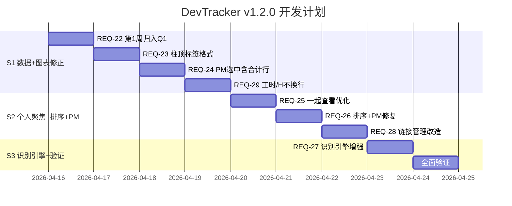

# DevTracker v1.2.0 — 开发计划

> **版本**：v1.2.0  
> **需求文档**：`docs/@demand/requirements_v1.2.0.md`  
> **预计里程碑**：3 个 Sprint  
> **创建时间**：2026-04-16 12:02

---

## 里程碑划分



---

## Sprint 1：数据修正 + 图表 + 列头

### S1-1: REQ-22 第1周任务归入Q1

**问题根因**：`stats.js` 中 `getDateRange()` 返回 `Q1 = 2026-01-01 ~ 2026-03-31`，但第1周 `start_date = 2025-12-28`，不在范围内。

**修改文件**：`backend/src/routes/stats.js`

**方案**：修改两处（部门统计 + 个人统计）任务查询逻辑，改用 `year` 字段 + 日期范围交集判定：

```javascript
// 原逻辑：仅按 start_date 范围
const tasks = await CollectionTask.findAll({
  where: { start_date: { [Op.gte]: startFrom, [Op.lte]: startTo } }
});

// 新逻辑：year 字段匹配 + (start_date 或 end_date 与季度日期范围有交集)
const tasks = await CollectionTask.findAll({
  where: {
    year: yearNum,
    [Op.or]: [
      { start_date: { [Op.between]: [startFrom, startTo] } },
      { end_date: { [Op.between]: [startFrom, startTo] } }
    ]
  }
});
```

### S1-2: REQ-23 柱顶标签格式

**修改文件**：`frontend/src/views/StatsPage.vue` — `drawChart()` 函数

**改动**：

```javascript
// 原：const labelText = val.toFixed(0)
// 新：
const labelText = `${BAR_LABELS[bi]} ${val.toFixed(0)}`
```

同时调整字体大小和位置偏移，防止文字过长重叠：
- 字体从 `bold 11px` 调整为 `bold 10px`
- 若柱体宽度不足以放下文字，可旋转或缩减

### S1-3: REQ-24 PM选中合计行高亮

**修改文件**：`frontend/src/views/StatsPage.vue` — `rowClassName()` 函数

```javascript
// 原：
function rowClassName({ row }) {
  if (row.isTotalRow) return 'dt-total-row'
  if (selectedPM.value && row.pmName === selectedPM.value) return 'dt-row-selected'
  return ''
}

// 新：合计行也参与 PM 选中判定
function rowClassName({ row }) {
  const isSelected = selectedPM.value && row.pmName === selectedPM.value
  if (row.isTotalRow && isSelected) return 'dt-total-row dt-row-selected'
  if (row.isTotalRow) return 'dt-total-row'
  if (isSelected) return 'dt-row-selected'
  return ''
}
```

### S1-4: REQ-29 工时/H列头不换行

**修改文件**：`frontend/src/views/ReportPage.vue`

**改动**：三个 `工时/H` 子列添加 `header-class-name` 或使用 `label-class-name`，在 `<style>` 中添加：

```css
:deep(.nowrap-header .cell) {
  white-space: nowrap;
}
```

三处 `<el-table-column label="工时/H">` 添加 `class-name="nowrap-header"`。

---

## Sprint 2：个人聚焦 + 排序 + 链接管理

### S2-1: REQ-25 一起查看优化（4项子需求）

**修改文件**：`frontend/src/views/StatsPage.vue` — 一起查看模板区

#### 25a 折叠展开
- 为每个人的每个任务添加折叠/展开状态
- 新增 `allExpandedMap = ref({})` — `{ staffId_taskId: boolean }`
- 默认收起，点击闪现详细记录
- 每行任务只显示标题 + 总工时，点击展开后显示详细记录

#### 25b 字体统一
- 个人名称行工时：`font-weight:700; font-size:13px`
- 周期工时：统一为同样的 `font-weight:700; font-size:13px`（当前是 `font-weight:600`）

#### 25c 周期倒序
- 在 `loadAllPersonalData()` 中，对每个人的 `tasks` 数组按 `start_date` 降序排列：
```javascript
data.tasks?.sort((a, b) => new Date(b.start_date) - new Date(a.start_date))
```

### S2-2: REQ-26 排序 + PM修复

**修改文件**：`frontend/src/views/TaskDetail.vue`

#### 26a 角色排序

定义角色排序常量和排序函数：

```javascript
const ROLE_SORT_ORDER = { backend: 0, frontend: 1, test: 2 }

const sortedRecords = computed(() => {
  return [...recordStore.list].sort((a, b) => {
    const ra = ROLE_SORT_ORDER[a.staff?.role] ?? 99
    const rb = ROLE_SORT_ORDER[b.staff?.role] ?? 99
    return ra - rb
  })
})

const sortedLinks = computed(() => {
  return [...links.value].sort((a, b) => {
    const ra = ROLE_SORT_ORDER[a.staff?.role] ?? 99
    const rb = ROLE_SORT_ORDER[b.staff?.role] ?? 99
    return ra - rb
  })
})
```

模板中 `recordStore.list` → `sortedRecords`，`links` → `sortedLinks`。

#### 26b 修复PM为空

**根因分析**：`product_managers` 字段在数据库中存储为 JSON 字符串（如 `'["杨瑞"]'`），后端返回时可能未自动解析。TaskDetail 模板中的显示逻辑：
```javascript
{{ Array.isArray(row.product_managers) ? row.product_managers.join(', ') : '-' }}
```
若 `product_managers` 是字符串而非数组，则显示 `-`。

**修复**：添加安全解析函数：
```javascript
function parsePM(val) {
  if (Array.isArray(val)) return val
  if (typeof val === 'string') {
    try { return JSON.parse(val) } catch { return [] }
  }
  return []
}
```
模板改为：`{{ parsePM(row.product_managers).join(', ') || '-' }}`

### S2-3: REQ-28 链接管理改造

**修改文件**：`frontend/src/views/TaskDetail.vue`

#### 28a 预设通知文本
```javascript
// 原：const notifyText = ref('请填写本周工作内容，链接如下：')
// 新：
const notifyText = ref('请填写上周工作内容，您的专属链接如下：')
```

#### 28b 操作列拆分

新增 `copyLinkOnly` 函数；重命名现有 `copyLink` → `copyAll`：

```javascript
/** 复制链接（仅URL） */
async function copyLinkOnly(link) {
  try {
    await navigator.clipboard.writeText(buildFillUrl(link.token))
    ElMessage.success('链接已复制')
  } catch { ElMessage.error('复制失败') }
}

/** 复制全部（通知文本+链接） */
async function copyAll(link) {
  const fullText = `${notifyText.value}\n${buildFillUrl(link.token)}`
  try {
    await navigator.clipboard.writeText(fullText)
    ElMessage.success('通知文本+链接已复制')
  } catch { ElMessage.error('复制失败') }
}
```

模板操作列：
```html
<el-button type="primary" link size="small" @click="copyLinkOnly(row)">复制链接</el-button>
<el-button type="primary" link size="small" @click="copyAll(row)">复制全部</el-button>
<el-button type="primary" link size="small" @click="sendLink(row)">发送</el-button>
```

操作列宽度从 `150` 调整为 `200`。

---

## Sprint 3：识别引擎增强 + 全面验证

### S3-1: REQ-27 识别引擎增强

**修改文件**：`frontend/src/views/FillPage.vue` — `parseRecognizeText()` 函数

#### 27a PM单字匹配

替换精确匹配为模糊单字匹配：

```javascript
/**
 * PM 模糊匹配：文本中包含PM名字的任意一个字即匹配
 * 若多个PM匹配，取匹配字数最多的
 */
function fuzzyMatchPM(text) {
  const results = []
  for (const pmName of PM_OPTIONS) {
    let matchCount = 0
    for (const char of pmName) {
      if (text.includes(char)) matchCount++
    }
    if (matchCount > 0) {
      results.push({ name: pmName, matchCount })
    }
  }
  if (results.length === 0) return []
  // 按匹配字数降序，取最佳匹配
  results.sort((a, b) => b.matchCount - a.matchCount)
  return [results[0].name]
}
```

在自然语言解析分支中，PM匹配改为调用 `fuzzyMatchPM(remaining)`，替换原有的精确字符串匹配。

#### 27b 天单位识别

扩展正则，增加天/d/D/日的匹配：

```javascript
// 工时正则（含天单位）
const HOURS_RE = /(\d+(?:\.\d+)?)\s*(?:h|小时|H)?\s*$/i
const DAYS_RE = /(\d+(?:\.\d+)?)\s*(?:天|d|D|日)\s*$/i
const HOURS_WITH_UNIT = /(?:^|\s|[|,，\t])(\d+(?:\.\d+)?)\s*(?:h|小时|H)(?:\s|[|,，\t]|$)/i
const DAYS_WITH_UNIT = /(?:^|\s|[|,，\t])(\d+(?:\.\d+)?)\s*(?:天|d|D|日)(?:\s|[|,，\t]|$)/i
```

解析顺序：先尝试天单位 → 再尝试小时单位 → 最后纯数字。天单位匹配后 `hours = val * 8`。

#### 27c 纯数字工时

在尾部数字匹配时，增加范围校验 1-60：

```javascript
if (hours !== null && (hours < 1 || hours > 60)) {
  hours = null  // 超出合理范围，不识别为工时
}
```

---

## 文件变更清单

| 分类 | 文件路径 | 操作 | 涉及需求 |
|:---|:---|:---|:---|
| **后端路由** | `routes/stats.js` | 修改 | REQ-22 |
| **前端视图** | `views/StatsPage.vue` | 修改 | REQ-23, REQ-24, REQ-25 |
| **前端视图** | `views/TaskDetail.vue` | 修改 | REQ-26, REQ-28 |
| **前端视图** | `views/FillPage.vue` | 修改 | REQ-27 |
| **前端视图** | `views/ReportPage.vue` | 修改 | REQ-29 |

---

## 验证计划

### 自动验证
- 每个 Sprint 完成后浏览器全页面验证
- 检查 JS 控制台零错误

### 关键验证点
1. **REQ-22**：周期统计选择2026年Q1，确认第1周数据出现
2. **REQ-23**：柱状图柱顶显示 `前端 24` 格式
3. **REQ-24**：点击PM名字，对应合计行一起高亮
4. **REQ-25**：一起查看模式下周期默认折叠、字体统一、倒序
5. **REQ-26**：提交数据/链接管理按后端→前端→测试排序；PM有数据则显示
6. **REQ-27**：粘贴 `用户中心 瑞 2d` → 匹配杨瑞 + 16小时
7. **REQ-28**：复制链接/复制全部两个按钮分别有效
8. **REQ-29**：工时/H列头不换行
