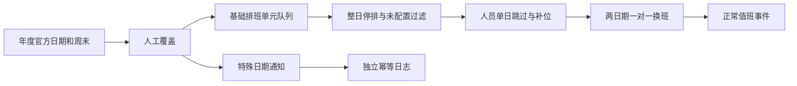

# 节假日跳过与排班例外测试源摘要

## 范围来源

- 需求：`docs/@demand/duty_holiday_calendar_and_schedule_exceptions_20260821.md`。
- 技术方案：`docs/@development/duty_holiday_calendar_and_schedule_exceptions_plan_20260821.md`。
- 实施记录：`docs/@development/duty_holiday_calendar_and_schedule_exceptions_implementation_20260821.md`。
- 官方日期源：中国政府网《国务院办公厅关于2026年部分节假日安排的通知》，国办发明电〔2025〕7号。

## 已冻结业务解释

1. 周固定、周轮换和月固定均使用排班单元队列；整日停排和未配置日期不丢单元。
2. 人员单日跳过时，被跳过单元与补位单元均消耗；固定多人仅在全部人员被移除时拉取下一单元。
3. 所有周六、周日默认停排，包括官方调休上班周末；管理员可改为强制工作日。
4. 候选人员只排除离职，保留在职、留职、长假。
5. 年度日历全局生效；人员跳过、临时换班和特殊通知绑定自动值班规则。
6. 首次启用从下一未执行日期生效，不回算成功历史。
7. 每条规则每个日期最多一条特殊通知，使用该规则全部启用 webhook。
8. 正常值班和特殊通知使用独立幂等日志。

## 测试数据边界

- 测试规则前缀：`CODEX-DUTY-CALENDAR-20260821`。
- 正式人员只读复用 ID、姓名、角色和状态，不修改人员记录。
- 真实发送仅指向测试进程启动的 `127.0.0.1` 临时接收器，不访问正式 webhook。
- 测试年度修订使用未来生效日期；结束后删除测试修订并恢复原修订活动状态。
- 不提交、不推送、不打包、不发布。

## 流程图

