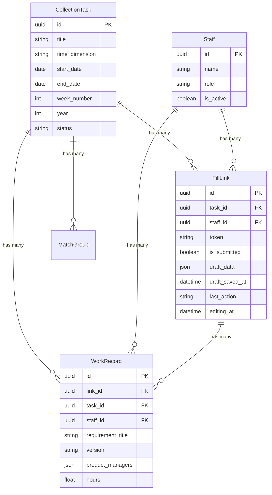

# DevTracker 系统架构概览

> 最后更新：2026-04-16 v1.4.0

## 一、系统定位

DevTracker 是一个**工时收集与统计**系统，核心流程：
1. 管理员创建收集任务（按周/月/季度等维度）
2. 系统为每位人员生成专属填写链接
3. 开发人员通过链接填写工时
4. 管理端查看汇总报表和周期统计

## 二、技术栈

```
前端：Vue 3 + Element Plus + Pinia + Vue Router
构建：Vite 8
后端：Express.js + Sequelize ORM
数据库：MySQL
部署：PM2 + Nginx（反向代理）
```

## 三、目录结构

```
get_data_cursor/
├── frontend/
│   ├── src/
│   │   ├── api/              # Axios 封装
│   │   ├── components/       # 公共组件
│   │   │   ├── AppHeader.vue      # 顶部导航栏（含雷达Logo）
│   │   │   ├── CreateTaskModal.vue # 新建/编辑任务弹窗
│   │   │   └── BackButton.vue     # 返回按钮
│   │   ├── router/           # Vue Router 配置
│   │   │   └── index.js           # 路由 + 权限守卫
│   │   ├── stores/           # Pinia 状态管理
│   │   │   ├── auth.js            # 权限状态
│   │   │   ├── task.js            # 任务列表
│   │   │   ├── report.js          # 需求工时报表
│   │   │   └── stats.js           # 周期统计
│   │   ├── styles/
│   │   │   └── main.css           # 全局样式（菁英蓝设计系统）
│   │   ├── utils/
│   │   │   └── sync.js            # BroadcastChannel 跨tab同步
│   │   ├── views/
│   │   │   ├── TaskList.vue       # 任务收集列表（年份+Q1-Q4页签）
│   │   │   ├── TaskDetail.vue     # 任务详情（链接管理+提交数据）
│   │   │   ├── FillPage.vue       # 填写工时（双栏：表单+历史）
│   │   │   ├── ReportPage.vue     # 需求工时统计
│   │   │   ├── StatsPage.vue      # 周期统计（季度）
│   │   │   ├── PersonnelPage.vue  # 团队人员管理
│   │   │   ├── PermissionPage.vue # 权限控制
│   │   │   └── ForbiddenPage.vue  # 403无权限页
│   │   ├── App.vue            # 根组件（含footer）
│   │   └── main.js            # 入口
│   ├── vite.config.js         # Vite配置（base: /devtracker/）
│   └── package.json
├── backend/
│   ├── src/
│   │   ├── models/            # Sequelize Models
│   │   │   ├── CollectionTask.js
│   │   │   ├── FillLink.js
│   │   │   ├── WorkRecord.js
│   │   │   ├── MatchGroup.js
│   │   │   ├── Staff.js
│   │   │   └── index.js       # 关联关系定义
│   │   ├── routes/
│   │   │   ├── tasks.js       # /api/tasks CRUD + generate-links
│   │   │   ├── fill.js        # /api/fill/:token（获取/提交/草稿/历史）
│   │   │   ├── records.js     # /api/records
│   │   │   ├── staff.js       # /api/staff
│   │   │   ├── stats.js       # /api/stats（部门/个人统计）
│   │   │   ├── report.js      # /api/report
│   │   │   └── permissions.js # /api/permissions
│   │   ├── utils/
│   │   │   └── parseJson.js
│   │   └── app.js             # Express app
│   ├── .env.production
│   └── package.json
├── deploy/
│   ├── deploy.py              # 自动化部署脚本
│   ├── fix_week_dates.py      # 数据迁移：周日→周一
│   ├── ecosystem.config.js    # PM2配置
│   └── nginx-devtracker.conf  # Nginx location block
└── docs/
    ├── architecture/          # 架构文档
    ├── development/           # 开发过程文档
    └── plan/                  # 开发计划
```

## 四、核心数据模型



## 五、权限系统

```
管理员模式：?admin=1 → sessionStorage 记忆
权限链接模式：?token=xxx → 后端校验 → 按资源+操作授权
资源：page:tasks, page:report, page:stats, page:personnel, page:permissions
操作：can_view, can_create, can_update, can_delete
```

## 六、设计系统

- **主题**：菁英蓝（--color-primary: #165DFF）
- **字体**：Inter + Microsoft YaHei
- **Logo**：SVG雷达图标（蓝紫渐变 + 旋转扫描动画）
- **Footer**：DevTracker v1.4.0 · © 2026 · 2698-jfzhu8023
